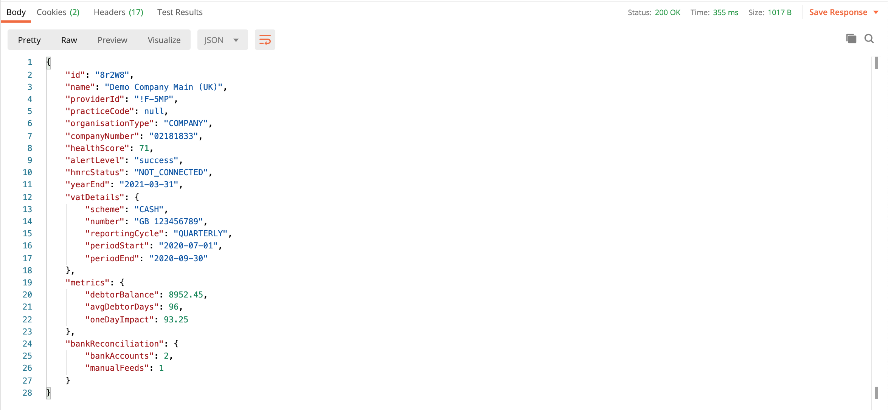
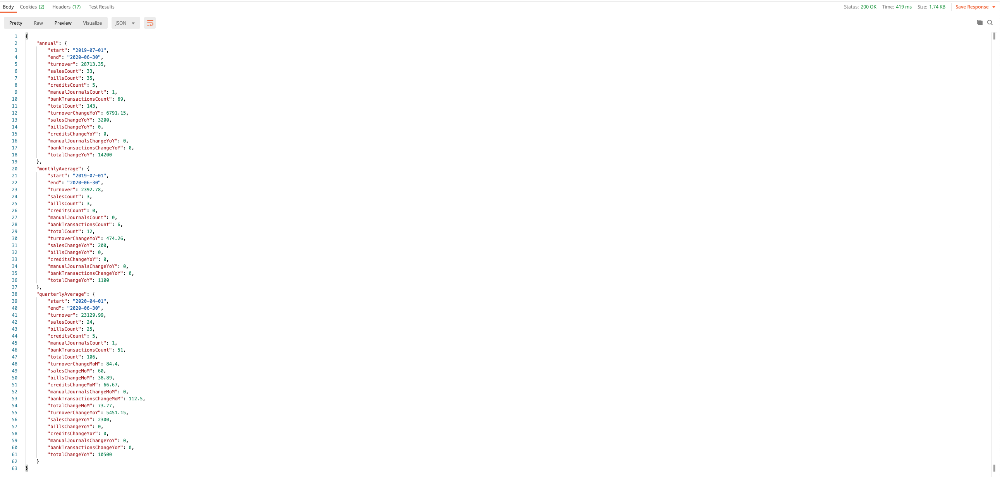

---

---
# API

Xavier offers a RESTful API to extract basic data contained within your Xavier account. If you would like to access to the API, please [get in touch](/contact-us.html).

::: warning
 Please note, the Xavier API is currently in BETA. It may change in the future.
:::

## Getting Started

The current version of the API lives at: ```https://api.xavier-analytics.com/```

The easiest way to start using our API is by finding an HTTP client online. We would recommend using <a href="https://www.getpostman.com/downloads/">Postman</a>, or <a href="https://paw.cloud/">Paw</a> as they are ready-to-use, free tools.

In our demo we are going to use <a href="https://www.getpostman.com/downloads/">Postman</a>.

<!-- ### Versions:

| Versions        | Release Date   | Changes  |
| ------------- |:-------------:| -----|
| version 1.0 BETA      | 07/01/2020 | Initial deployment | -->

### Endpoints Summary

| Endpoint        | What it does   |
| ------------- |:-------------:| -----|
| [/clients](/api.html#get-clients) | Returns a list of Clients|
| [/clients/{clientId}](/api.html#get-clients-clientid) | Returns details of a specific Client|
| [/clients/{clientId}/activity-stats](/api.html#get-clients-clientid-activity-stats) | Returns Activity Stats metrics for a specific Client|

## Authentication

In order to get data out, you must pass an authorization token in the request header:

**Request Header:** ```Authorization: Bearer <your token>```

To generate a token please use the following instructions:

In Xavier head to "Your Settings" and under the API tab generate your token.


::: warning
Store the token securely and do not share it with anyone else!
:::

For example, to use your token in <a href="https://www.getpostman.com/downloads/">Postman</a>, select _bearer token_ as your authentication method and copy your given token into the correct field. See below:


## Rate Limits

A rate limit restricts the number of API requests a consumer can make within a given time period. If this limit is exceeded the consumer will be throttled and API requests will fail.

**Xavier Rate Limits are set to 60 requests / minute.**

If you exceed your rate limit allowance your request will be rejected. An *<a href="#_429-too-many-requests">HTTP 429 (Too Many Requests)</a>* response will be returned.

Xavier returns rate limit details in the header of API responses to allow consumers to monitor their API usage.

Example response header:
| Key        | Value   |
| ------------- |:-------------:| -----|
| Date | Thu, 30 Jan 2020 16:27:15 GMT |
| Content-Type | application/json|
| Connection | keep-alive|
| Server | cloudflare|
| X-RateLimit-Limit | 60 |
| X-RateLimit-Remaining | 42 |

## Response Codes

### 200 - OK
A 200 status code indicates that the request was accepted and processed successfully.

### 404 - Not found
A 404 error status code indicates that the API can't map the requested URI to a resource.

### 429 - Too many requests
A 429 error status code is returned when an API consumer hits Xavier's [rate limits](/api.html#rate-limits).

### 500 - Internal Server Error
A 500 error status code is a generic API server-side error response. Please [contact](/contact-us.html) our support team if this persists.


## API Endpoints

### GET /clients
***

The `/clients` endpoint returns a list of all Xavier clients that the given [authentication token](/api.html#authentication) has access to, in a summarised format.

**Request:** ```https://api.xavier-analytics.com/clients```

**Response Content Type:** *application/JSON*

**Response Model:**

```json
[
    {
        "id": "string",
        "name": "string",
        "practiceCode": "string",
        "providerId": "string",
        "healthScore": integer
    }
]
```
**Example value:**


### GET /clients/{clientId}
***

The `/clients/{clientId}` endpoint returns a detailed set of information about a particular client identified by the `clientId`, including some calculated metrics.

**Request:** ```https://api.xavier-analytics.com/clients/{clientId}```

**Response Content Type:** *application/JSON*

**Response Model:**

```json
{
    "id": "string",
    "name": "string",
    "providerId": "string",
    "practiceCode": "string",
    "organisationType": "string",
    "healthScore": integer,
    "hmrcStatus": "string",
    "vatNumber": "string",
    "metrics": {
        "debtorBalance": float,
        "avgDebtorDays": integer,
        "oneDayImpact": integer,
    }
}
```
**Example value:**



### GET /clients/{clientId}/activity-stats
***

The `/clients/{clientId}/activity-stats` endpoint returns the rolling annual and monthly-average [Activity Stats](/insights.html#activity-stats) for a particular client, identified by the `clientId`.

**Request:** ```https://api.xavier-analytics.com/clients/{clientId}/activity-stats```

**Response Content Type:** *application/JSON*

**Response Model:**

```json
{
    "annual": {
        "start": "string",
        "end": "string",
        "turnover": float,
        "salesCount": integer,
        "billsCount": integer,
        "creditsCount": integer,
        "manualJournalsCount": integer,
        "bankTransactionsCount": integer,
        "totalCount": integer,
        "turnoverChangeYoY": integer,
        "salesChangeYoY": integer,
        "billsChangeYoY": integer,
        "creditsChangeYoY": integer,
        "manualJournalsChangeYoY": integer,
        "bankTransactionsChangeYoY": integer,
        "totalChangeYoY": integer
    },
    "monthlyAverage": {
        "start": "string",
        "end": "string",
        "turnover": float,
        "salesCount": integer,
        "billsCount": integer,
        "creditsCount": integer,
        "manualJournalsCount": integer,
        "bankTransactionsCount": integer,
        "totalCount": integer,
        "turnoverChangeYoY": integer,
        "salesChangeYoY": integer,
        "billsChangeYoY": integer,
        "creditsChangeYoY": integer,
        "manualJournalsChangeYoY": integer,
        "bankTransactionsChangeYoY": integer,
        "totalChangeYoY": integer
    }
}
```

**Example value:**


