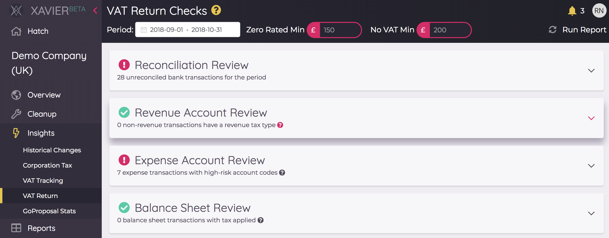

# Checks
Xavier has compiled a number of it's insights and cleanup tools, along with specialist calcuations, into one view 
designed to fit into your practice processes. These checks have their own date filters that apply to the insights and 
tools within, so you can run through them when the time calls. We call these *Checks*...

## VAT Return Checks
Xavier provides a set of checks that have been designed to quickly spot tax issues with respect to transaction data over
a given filing period. Simply enter in the date range and the minimum amounts (more on those below) and hit *Run Report*
to generate the checks. Expanding the card allows you to see these transactions, with a link directly to Xero to sort
them out.

### Reconciliation Review
This uses the same logic as the [Unreconciled Transactions](/insights.html#unreconciled-transactions) insight to find
unreconciled transactions for the date range you have supplied.

### Revenue Account Review
This check finds transactions that don't have an Account Class of REVENUE, but have been assigned as revenue Tax Type of
OUTPUT2, RROUTPUT or ZERORATEDOUTPUT.

### Expense Account Review
This check finds expense transactions that have been assigned a Tax Type of INPUT2 (20% VAT on Expenses), with accounts
that have [Reporting Codes](https://central.xero.com/s/article/Report-codes-for-practices-using-report-templates) of 
EXP.ADM.ENT (Entertainment), EXP.ADM.PRI (Printing & Postage) or EXP.ADM.TRA (Travel International).

### Balance Sheet Review
This check finds ASSET, LIABILITY or EQUITY type transactions with a non-zero tax value, excluding Fixed Assets (account
type FIXED) and Reporting Codes of LIA.CUR.ACC (income in advance) or ASS.CUR.REC.PRE (prepayments).

### Zero-Rated Review
This check finds transactions with a tax type of ZERORATEDINPUT with a net value above the minimum amount set by you in
the report header (*Zero Rated Min*). The idea here is to ensure the client is claiming back VAT on as many high value
items as possible.

### No-VAT Review
This check finds transactions with a tax type of NONE with a net value above the minimum amount set by you in
the report header (*No VAT Min*).

### Multi-coded Contacts
The same as the [Multi-Coded Contacts](/insights.html#multi-coded-contacts) insight, but looking at contacts that
have transactions in the reporting period specified.

## Health Check
The health check is designed for practices to run through on a regular basis with their clients, ensuring that the books 
are kept clean and providing value to the client. The process hits a number of touch points to make sure clients are 
financially prepared as well as highlighting any issues before they become a real problem. 

Simply enter in the date range and hit *Recalculate* to generate the checks. 

The traffic light system tells you which checks require attention. Key stats are displayed at a glance, and you can 
click to expand the card and see more detail or head through to the actual insight.

Clicking the *speech bubble* beside each card will toggle to display some narrative around the purpose of the check, and 
how to approach it with your client. You can click the speech bubble again to close it. 

### Unreconciled Transaction
This uses the same logic as the [Unreconciled Transactions](/insights.html#unreconciled-transactions) insight to find
unreconciled transactions for the date range you have supplied, and the age of the oldest unreconciled transaction. The 
indicator will be amber if there are unreconciled transactions over 15 days old, and red for if there are any over 30 
days old. 

### Multi-coded Contacts
The same as the [Multi-Coded Contacts](/insights.html#multi-coded-contacts) insight, but looking at contacts that
have transactions in the reporting period specified.

### Regular Suppliers
The same as the [Regular Suppliers](/insights.html#regular-suppliers) insight, but looking at suppliers active during 
that period with potential anomalies.

### PAYE Status
This check balances manual journals against detected payments with PAYE account codes to ensure a correct PAYE status at 
a point in time. 
By default, the check calculates the PAYE control account balance based on account codes found under the reporting code 
*LIA.CUR.TAX.OTH*. You can change the account codes used by clicking the small cog next to the card title. Expanding the 
card shows the detailed grid of PAYE transaction history for the last 6 months.

The PAYE check runs through the following logic:
- All is well: if the Control Account balance is 0 and there is a Manual or Xero Payroll Journal present in the last
complete month
- All is well: the Control Account balance is equal to the amount posted in the Manual or Xero Payroll Journal(s) in the
last complete month, and the snapshot date is well in advance of the HMRC Deadline
- Warning: Contol Account and Journals balance, but HMRC payment due date is approaching
- Error: No Manual or Xero Payroll Journal found in the last complete month
- Error: No payment detected, and HMRC payment deadline is past due
- Error: Control Account balance is non-zero and does not reconcile with balance of Manual or Xero Payroll journals

### VAT Status
A summary of the [VAT Tracking](/insights.html#vat-tracking) insight reporting on the VAT accrued since the start of the period, and 
if the annual taxable turnover is within the threshold of your detected scheme. 

### Estimated Corporation Tax
A summary of the [Corporation Tax](/insights.html#corporation-tax) insight, sharing the next estimated payment for the 
previous period, and the estimated corporation tax accrued for the current period.

