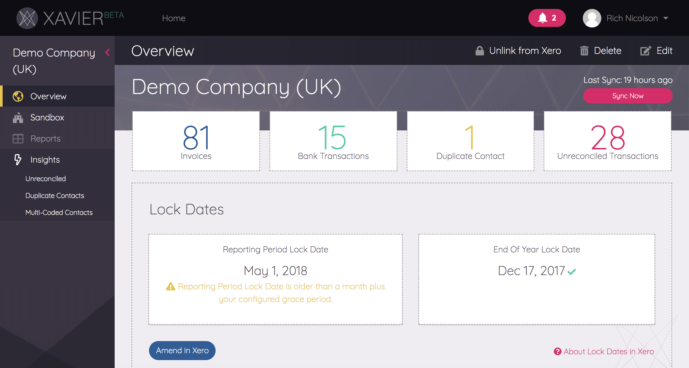
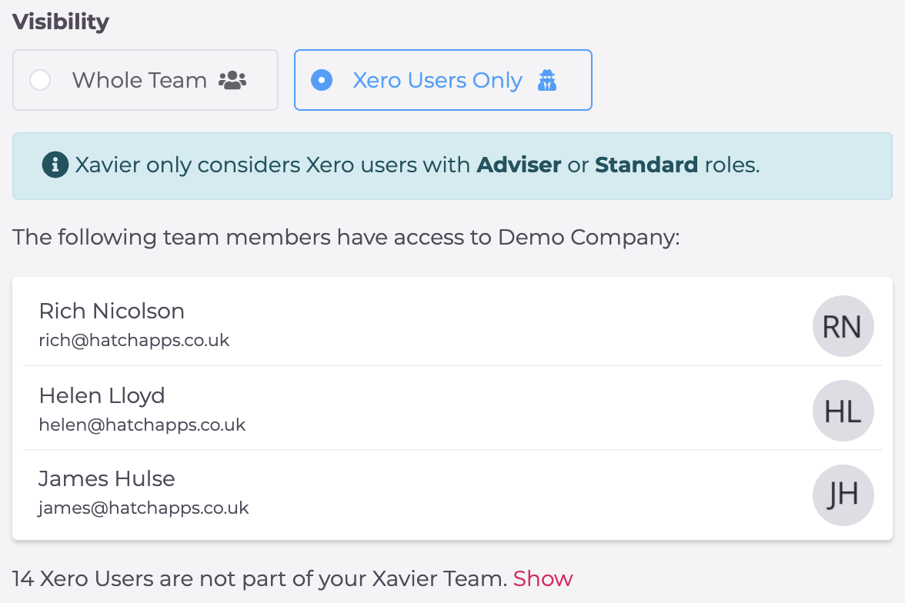

# Clients

A *Client* in Xavier is linked to an *Organisation* in Xero.  

Xavier is at it's most powerful for accountancies when you have added all your practice clients. The *Client List* and *Practice Dashboard* are 
essential tools for prioritising and staying on top of your clients and keeping an eye on your practice performance; 
you'll be able to handle issues as and when they occur, and your clients will always feel like the centre of attention. 

## Client List

This is your *Team* home page in Xavier, and also where you can add, search and access each of your clients. 
In this view, you can choose to display all clients, only the clients you are an Account Manager for, 
or the ones you have selected as favourites. Click on each of the client cards to view the *Client Overview* for that client.

<iframe width="560" height="315" src="https://www.youtube.com/embed/TJ0_MaW1rP8?rel=0" frameborder="0" allow="autoplay; encrypted-media" allowfullscreen></iframe>

You can sort and filter your clients from this view for an at-a-glance practice overview. 
Sort by the general [Client Health Score](/clients.html#client-health-score), or select an insight metric and choose to sort by either it's individual *Health Score* 
or the number of issues identified for that insight (i.e., by volume). You can choose to sort ascending or descending, 
and combined with the filtering of the list by My Accounts and Favourites, the "at a glance" reporting potential is 
quite powerful.

In each of the client cards, on the left you can view the company name, and their last sync date. A small pink padlock 
icon indicates that the client is no longer linked to Xero, and you will need to [re-link](https://help.xavier-analytics.com/xero-integration.html#managing-the-xero-connection) 
that client by clicking in to their Client Overview.

On the right of the client card, you can view the client's metric (if one is selected from the dropdown), 
their overall health score, the account manager's icon, a star button for selecting that client as a 'favourite' and a 
three-dot menu icon - clicking this menu icon will allow you to view that client in Xero, sync with Xero or delete.  

 

### Start getting ahead of the curve

Here's some scenarios that will immediately benefit from this kind of practice-level insight:

* As a Managing Director, which of my team's clients needs attention the most, right now?
* Similarly, as an Account Manager, which of my clients needs some help?
* We're considering taking on a new client - what is the general state of their books so I can price accordingly?
* I'd like to get a team member onto sorting out the Fixed Assets Register across the board, but which clients should they start with?
* How are the clients doing that are being looked after by my newest bookkeeper?
* Which client has got the highest ratio of Multi-Coded Contacts so we can look to improve their coding processes?

## Practice Dashboard

The Practice Dashboard is a KPI data playground across all of your clients. This view contains the data from the Client List including 
all of your client metrics, plus links straight to the client in Xero for you to compare data across clients or account managers.  

<iframe width="560" height="315" src="https://www.youtube.com/embed/K9MX2tsKMW4?rel=0" frameborder="0" allow="autoplay; encrypted-media" allowfullscreen></iframe>
 
The Practice Dashboard looks, and functions, just like the [Xavier Sandbox](https://help.xavier-analytics.com/sandbox-reporting.html#customising-the-sandbox); 
a drag and drop report-builder, with 
spreadsheet-like functionality. You can choose the columns you want to see, group-by, sort, collapse and expand until 
you get it just how you want. If you're a fan of Excel's pivot tables, you'll find that option too in the columns panel 
on the right.

You can save or export your configurations to Excel, using the buttons in the secondary navigation at the top right. 

You can save these configurations in your *Practice Dashboard* by selecting *save*. 
You'll need to give your dashboard a name, then decide whether to keep this report configuration private, or share it with the rest of your team.
Saved dashboards can be accessed by selecting *Custom Dashboards* in the sidebar. Just like 
[custom reports](https://help.xavier-analytics.com/sandbox-reporting.html#custom-reports), they can then be edited, 
favourited, or deleted from this view.  

## Client Overview
Clicking on a client card from the *Client List* will take you through to the management of that specific client.

In addition to providing high level stats about a client, the overview is where you can manage a client, 
adjusting specific aspects from the *Edit* button, removing it from Xavier via the *Delete* button and un-linking it from
Xero using the *Unlink* button. 

Unlinking a client from Xero means it will remain in Xavier, but will no longer sync with Xero to retrieve the latest 
changes. A client can be re-linked to Xero at any point, and syncing will resume.  

[Syncing with Xero](/xero-integration.md#syncing) happens automatically overnight, but you can also trigger a sync on-demand 
via the *Sync Now* button. 

This view also highlights any issues with the client's Lock Dates - [find out more](/team-management.md#lock-dates).

You can *export* the client overview in both PDF and .XLS format: 

- The PDF export contains your team branding (which you can add in the [Team Profile](/team-management.html#team-profile)) 
and additional explanations for each item, which will make it easier for your client to understand. The items are also 
arranged in priority order. 
- The .XLSX format is a really stripped-down version of the overview, which is perfect for linking into your own spreadsheet 
reports.  

## Client Health Score

Xavier calculates an overall score for a client to indicate the health of their books. You'll find the Health Score 
displayed on each client in the Client List, and on each client's Overview page underneath their name. A lot of our cleanup tools and insights 
now have an individual Health Score, which the overall Health Score is derived from. You can now focus on improving the 
data quality of your clients and easily see that progress on a daily basis.

The score is presented as a percentage, with a heart icon for traffic-light status. The health score is relative to the 
date selected, and proportional to the size of the client. The following Xavier elements contribute to the health score
currently:

* Bank Reconciliation
* Multi-Coded Contacts
* Duplicate Contacts
* Regular Supplier Anomalies
* Lock Dates
* Fixed Assets
* Dormant Accounts
* Contact Defaults
* Aged Balances
* PAYE (if configured)

::: tip
The algorithm for the health score will evolve as we fine-tune the weighting of Xavier's different cleanup and insight
scores on the final health score, but keep aiming for that 100%!
:::

## Client Visibility

Xavier provides two options for determining who in your team can view a particular client's data. The following options
can be selected from the _Client Settings_ view:

**Whole Team:** everyone on your Xavier team can view this client's data.

**Xero Users Only:** only the users linked to the Client in Xero, with the Xero role of either _Adviser_ or _Standard_
will be able to view the client's data in Xavier. Xavier uses the email you signed up with to match to the user in Xero. 

If _Xero Users Only_ is selected, this view will show you which of your Xavier team members are eligible to view the
Client, and will also list the users in Xero that are not part of your Xavier team yet - you can choose to invite them
from here. Clients with _Xero Users Only_ will also show a different visibility icon on the _Client List_.

**Spectific Users Only:** only the users you have selected to view this client will be able to view the data in Xavier.

::: tip
The default visibility setting for clients is _Xero Users Only_. However if you are importing a client and your email 
address does not match the user you have signed into in Xero, the default setting will be _Specific Users Only_, and you 
will be asked to select those specific users in a popup before the client can be imported.
:::  