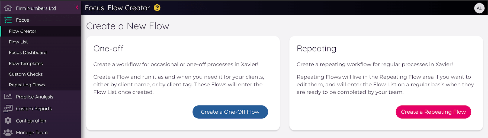
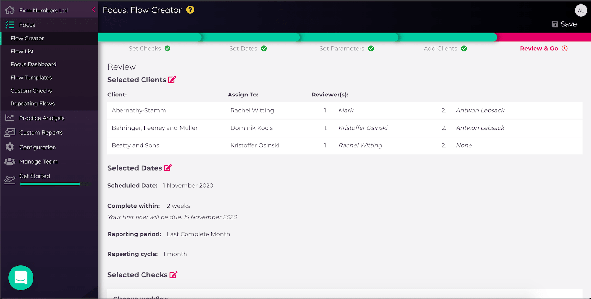
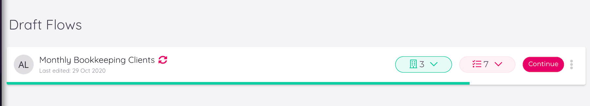
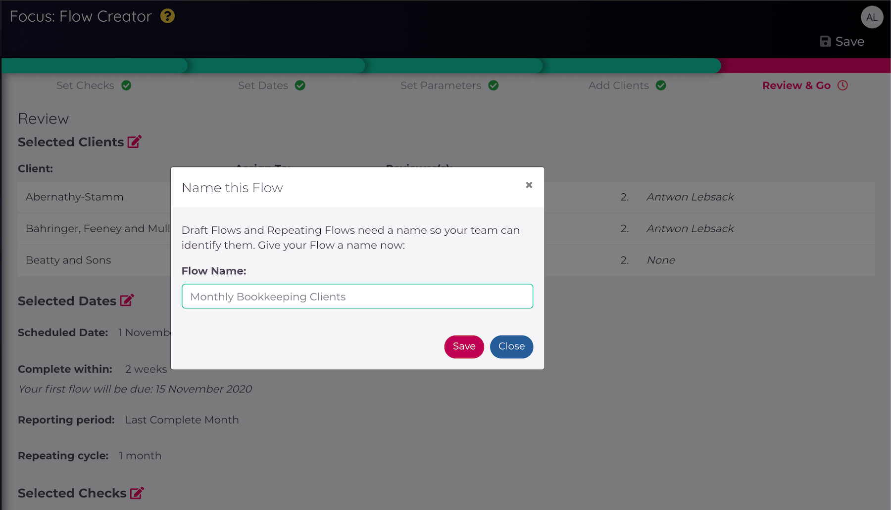
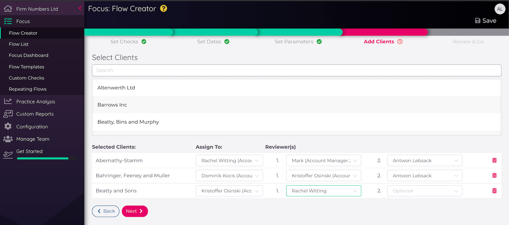
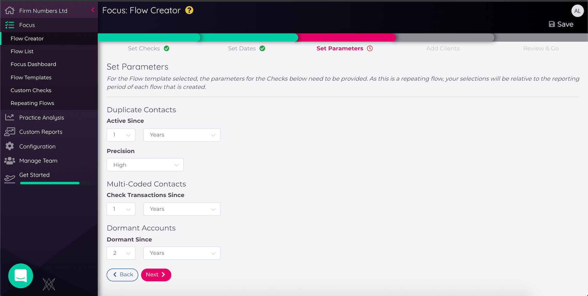
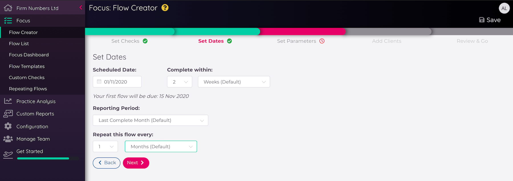

---

---
# Focus

Xavier Focus allows you to select from a library of tools and build a workflow that suits the business processes you
have developed around specific accounting jobs such as Tax Returns, Monthly Bookkeeping or Year End. 

Looking for some inspiration on how to use Xavier Focus? Check out our [Blog Post](https://xavier-analytics.com/blog/2020/05/29/focus-hacks/) on how to supercharge your processes with Focus here: [LINK](https://xavier-analytics.com/blog/2020/05/29/focus-hacks/)

For a guide to our latest Focus Update, introducing [Repeating Flows](/focus.html#repeating-flows), you can watch a quick [video guide](https://www.youtube.com/channel/UCFnpyIWi_tp9V39eThdcYPA) here: [LINK](https://youtu.be/2zBW1xLdTjQ)

## Focus Glossary

- [Check](/focus.html#checks): A tool or task in Xavier, typically with a set of calculated results 
- [Custom Check](/focus.html#custom-checks): A user-defined Check for directing to non-Xavier tasks
- [Flow Template](/focus.html#flow-templates): a selection of Checks in a specific order, that can be assigned to a Flow
- [Flow](/focus.html#inside-a-flow): a Flow Template linked to a Client, User and Reporting Period, with a Due Date
- [Flow History](/focus.html#flow-history): an audit trail of progress on a Flow
- [Repeating Flow](/focus.html#repeating-flows): A Flow that is set to repeat on a regular basis, which is linked to a Flow Template, Client(s), 
User(s) and a reporting time period, with a scheduled date and a time span for completion
- [Draft Flow](/focus.html#draft-flows): A Flow that has not yet been completed or published. 

## Checks

Xavier tackles all sorts of accounting insights, and spots many kinds of errors. These are organised into Checks,
which you can think of as individual tools or tasks that require review by someone.  

If the Check has a down-arrow on the right-hand-side, then it can be expanded to show more detailed information by 
clicking on the card:

Some Checks have additional configuration options that can be adjusted while you are in Flow Mode. These Checks have
cog icons beside their title. Clicking on the cog will bring up the options that can be adjusted:

Sometimes if a Check raises an alert then you are prompted to take action and fix whatever Xavier has found to be
the issue. Focus provides a library of these Checks that can be combined together into
[Flow Templates](/focus.html#flow-templates).   

### Check Master List

A list of all checks available in Xavier (last updated 17/5/20)

| Check   Name                            | Description                                                                                                                                                                                   |   
|-----------------------------------------|-----------------------------------------------------------------------------------------------------------------------------------------------------------------------------------------------|
| Aged Receivables                        | A review of your aged receivables balance, find out who is late in paying   you!                                                                                                              |   
| Average Debtor Days                     | The Debtor Days ratio shows the average number of days your customers are   taking to pay you.                                                                                                |   
| Bank Reconciliation                     | This shows the total of unreconciled transactions across all bank   accounts in Xero, as well as the oldest item. Ideally all transactions should   be reconciled as quickly as possible.     |   
| Aged Payables                           | A review of your aged payables balance - the invoices you have not paid   yet.                                                                                                                |   
| Client has paid PAYE                    | Confirm with the client that they have paid PAYE as per   HMRC                                                                                                                                |   
| Contact Defaults                        | Search each Contact's transaction history to suggest default reporting   codes or VAT Rates which are then pushed back into Xero.                                                             |
| Cost by Account Code                    | Designed to analyse the activity in the General Ledger over time and automatically detect issues.                                                                                             |
| Customer Reliance                       | Monitor business reliance on key customers and assess associated risk.                                                                                                                        |   
| Dividends Status                        | Keep track of who has declared dividends, how much they have declared and   when they declared them.                                                                                          |   
| Dormant Accounts                        | Give your chart of accounts a spring clean - review all of the account   codes which have not had activity in a while and archive them.                                                       |   
| Draft Invoices                          | Highlights any draft bills or sales invoices in Xero                                                                                                                                          |   
| Duplicate Contacts                      | Duplicate contacts goes through all your Xero contacts and matches   contacts that we think are the same supplier or customer.                                                                |   
| Duplicate Transactions                  | Xavier looks across invoices and bank transactions and highlights records   that it thinks could be unwanted duplicates.                                                                      |   
| Entertainment Accounts                  | A useful tool that tracks your spend on client and staff entertainment   and will let you know if you have breached any thresholds                                                            |   
| Estimated Corporation Tax               | A simple Corporation Tax estimate to keep track of how much tax your   client needs to pay.                                                                                                   |   
| Estimated VAT                           | An estimation of VAT liability for the period                                                                                                                                                 |   
| Fixed Asset Account Reconciliation      | We will take your fixed asset balance compare it to your balance sheet   balance, highlight imbalances and then tell you the date that the imbalance   started.                               |   
| Fixed Asset Accounts                    | Checks that Fixed Asset Account Types match up to a corresponding General   Ledger Account                                                                                                    |   
| Fixed Asset Depreciation Reconciliation | We will take your fixed asset depreciation account and compare it to your   balance sheet depreciation account, highlight imbalances and then tell you   the date that the imbalance started. |   
| Fixed Asset Depreciation Run Date       | Shows you the last time depreciation was run.                                                                                                                                                 |   
| Fixed Asset Drafts                      | Review all draft assets to check none need to be published to balance the   register                                                                                                          |   
| Historical Changes                      | Detects changes in a defined period of historical data, since a defined   date (such as a filing date).                                                                                       |   
| HMRC Status                             | Filing and Payment amounts and dates, direct from HMRC                                                                                                                                        |   
| Lock Dates Status                       | Track changes to Xero's lock dates and combine with account filing   information from Companies House (where available) to help you keep Xero data   stable                                   |   
| Multi-Coded Contacts                    | Multi-coded contacts searches through your contacts history to highlight   where a contact has been coded against multiple account codes of VAT rates.                                        |   
| Net Assets                              | Keep track of net assets over time, and compare current status with   previous periods.                                                                                                       |   
| Overpayments                            | Stay on top of overpayments                                                                                                                                                                   |   
| PAYE Status                             | Ensure the PAYE control account is behaving as it should.                                                                                                                                     |
| Payroll Status                          | Ensure the Payroll control account is behaving as it should.                                                                                                                                  |
| Pensions Status                         | Ensure the Pensions control account is behaving as it should.                                                                                                                                 |   
| Regular Suppliers                       | Designed to analyse payments to suppliers over time and automatically   detect issues.                                                                                                        |   
| Revenue Movement                        | Keep track of revenue over time, and compare performance with previous   periods.                                                                                                             |   
| Supplier Reliance                       | Monitor business reliance on key suppliers and assess associated risk.                                                                                                                        |   
| Tax Review By Code                      | Review all transactions for the period over a certain value, grouped by   sales tax code                                                                                                      |   
| Transactions with Attachments           | Review attachments for all transactions over a certain value for the   period                                                                                                                 |   
| Transactions without Attachments        | Review all transactions per the period over a certain value that don't   have attachments                                                                                                     |   
| VAT Balance Sheet Review                | For VAT Review - highlights any Balance Sheet transactions with sales tax   applied                                                                                                           |   
| VAT Control Account                     | Review the balance of the VAT Control Account against pending liabilities                                                                                                                     |   
| VAT Expense Account Review              | For VAT Review - highlights high-risk Expense transactions such as   Entertainment, Printing and Travel                                                                                       |   
| VAT Revenue Account Review              | For VAT Review - finds Revenue transactions that have a non-revenue tax   type                                                                                                                |   
| VAT Scheme Threshold                    | Compares rolling turnover with the business's VAT Scheme thresholds to   ensure compliance                                                                                                    |   
| Xero Activity                           | Monitor for sales and bills activity within Xero and raise alerts if none   are detected for 30 days                                                                                          |   

## Custom Checks

There's often non-Xavier tasks that you'd like your team members to work on during jobs like Management Reporting or
Year End. That's where Custom Checks come in. You can create your own Custom Checks that can be added to any Flow
Template you like. You can also include links in the description of the Check so your colleagues know where to go, by
highlighting a word:

## Flow Templates

A selection of Xavier's Checks can be combined together in a logical order into _Flow Templates_, designed for guiding
your colleagues through a specific job without needing to build lengthy internal process documents. Flow Templates can
be built on-the-fly when creating a Flow, at which point you can decide whether you only need the template once or you'd
like to save the template for re-use. They can also be created from the Flow Templates view.

Once multiple Checks have been added to a template they can be re-ordered by dragging and dropping.

All [Repeating Flows](/focus.html#repeating-flows) must be linked to a Flow Template. If a template linked to a Repeating Flow is edited, you will receive a warning with a list of affected Repeating Flows. 

- Any changes to a Repeating Flow template will take effect on the _next_ scheduled date, and will not effect any Repeating Flows that have entered the Flow List.
- Any checks added to templates that that require parameters will be added to Repeating Flows with the _default parameters_ applied, unless the Repeating Flow is edited to update the default parameters.    

## Creating Flows

  

Flows are created from the Flow Creator view. You can select to create either a [One-Off Flow](/focus.html#one-off-flows) or a [Repeating Flow](/focus.html#repeating-flows).

Once you have selected the type of Flow you want to create, the Flow Creator will walk you through a series of steps to build the Flow. 

- _Set Checks:_ Select the Checks you would like to use for the Flow, including any Custom Checks. You can either select a Flow Template, or create your own selection of Checks.
- _Set Dates:_ This step will differ between a Repeating and One-Off Flow, but these are the dates that determine the Flow start and due date, and the reporting period. 
- _Set Parameters:_ Some Checks require parameters to be set, such as a _'transactions since'_ parameter for [Multi-Coded Contacts](/insights.html#multi-coded-contacts).
- _Add Clients:_ Add the clients you would like to run the Flow for. You can select as many clients as you would like, and 
also assign the team members and reviewers who will complete the Flow. These will default to _Account Manager 1_ and _Account Manager 2_, respectively.
- _Review & Go:_ This stage will allow you to check the template, dates and clients all on one page before completing the Flow. 

  

During Flow creation, you can navigate forwards and backwards at the bottom of the form with the _'Next'_ and _'Back'_ buttons respectively. 
You can also click on the links below the coloured progress bar at the top to view stages you have previously completed.

### Draft Flows

  

A Draft Flow is a Flow that has not yet been published. They are stored in the _'Create Flow'_ view which can be accessed 
from the sidebar under _Focus_. 

During Flow creation, clicking _'Save'_ at the top right of the screen will allow you to save your Flow and give it a name. 
It will then appear in the Draft Flow list with the name it was assigned, and any additional details added during Flow creation.

  

Draft Flows will also be created if you close Xavier or click away from the Flow Creator at any time; if you do this, we'll 
name the Draft Flow after the template chosen as default.

In the Draft Flow List, each Flow will have the date it was last edited, and a pink _Repeating Flow_ icon will be present 
if the Flow was a Repeating Flow. 

Draft Flows can be edited or deleted. Simply click the _'Continue'_ button on the Draft Flow card to pick up where you left 
off. To delete the Draft Flow, you can use the three-dot menu to the right of the card and select 'Delete' from the dropdown list.

## One-Off Flows

Creating a one-off Flow involves assigning a Flow Template to one or more Clients, assigning a team member to the Client, and
selecting a reporting period and a due date for when the Flow needs to be completed. You can select a pre-existing 
[Flow Template](/focus.html#flow-templates), or build your own as you go.

### Adding Clients by Tag

If you are creating a One-Off Flow, you can add multiple clients to a Flow by selecting _By Tag_ in the _Add Client_ stage. This will add all clients to your 
Flow assigned to a specific tag. Select the account manager and reviewer you would like to use for this group, and then 
click _Add Clients From Tags_ to add these clients to your Flow. You will then be able to view the list of clients you 
have added, and edit assignees and reviewers and delete as necessary.  

::: tip
If you add multiple Clients when building a Flow, a Flow will be created for each Client.
::: 

If you are creating the Flow for just one Client there will also be the option to _'Save & Start'_. This provides a
shortcut where the Flow will be both created and started in one go, and you will be taken directly into
[Flow Mode](/focus.html#inside-a-flow).  

## Repeating Flows

Creating a Repeating Flow will follow a very similar process to creating a One-Off Flow, with a few exceptions:

### Repeating Flow Checks
Repeating Flows must always use a [Flow Template](/focus.html#flow-templates). You can create one during Flow creation.

If a template linked to a Repeating Flow is edited, you will receive a warning with a list of affected Repeating Flows. 
- Any changes to a Repeating Flow template will take effect on the _next_ scheduled date, and will not effect any Repeating
 Flows that have entered the Flow List.
- Any checks added to templates that that require parameters will be added to Repeating Flows with the _default parameters_ 
applied, unless the Repeating Flow is edited to update the default parameters.

When _Publishing_ a Repeating Flow, it will enter the [Repeating Flows List](/focus.html#the-repeating-flow-lis). The Flow 
will also enter the [Flow List](/focus.html#the-flow-list) if the creation date is the same as the _Scheduled Date_. 

You will only have the option to _'Save and Start'_ if the Repeating Flow is for only one Client, _and_ if the creation date 
is the same as the _Scheduled Date_.    

### Repeating Flow Dates

- _Scheduled Date:_ The date at which your Repeating Flow will first enter the Flow List. 
- _Complete Within:_ The time between the _Scheduled Date_ and the _Due Date_ for the Flow. 
- _Reporting Period:_ The dates the Flow Checks will refer to. This is a date range which is calculated backwards from 
the _Scheduled Date_. These can be client specific, for example _'Last Financial Year'_ which will refer to the most 
recent complete financial year after the _Scheduled Date_ for that client.  
- _Repeat this Flow every:_ The frequency of repetition for the Flow. This begins from the _Scheduled Date_.

Here's an example. For a Flow, created on the 28th of October with the following dates:
- _Scheduled Date:_ 1st November 
- _Complete Within:_ 2 Weeks 
- _Reporting Period:_ Last complete Month  
- _Repeat this Flow every:_ 1 Month

This Flow will enter the [Flow List](/focus.html#the-flow-list) on the 1st of November, and the first due date will be the 15th of November. The 
date range of the Flow will be the 1st to the 31st of October. The Flow will then appear in the Flow List every month on 
the 1st, to be due on the 15th. 

## Reviewers

Flows in Xavier can have up to two reviewers which you assign when creating the Flow. These reviewers are sent an email 
when the Flow is ready for review, starting with the first reviewer, who can either hand it back to the assigned user with 
any comments, or pass it on to the second reviewer (if assigned). The Flow can only be marked as complete once approved 
by the reviewer(s). Details of the reviewers and status are listed in the sidebar in Focus Mode.

## The Flow List

The Flow List shows all Flows to be completed for your team, and provides various filters to quickly find the Flows you are looking for.
You can filter Flows by their status (Not Started, In Progress, Complete), and order by different values such as Due 
Date and Period End. Use the search box to filter based on the Flow Template name. If the Flow is not yet completed,
warnings will be displayed as the Due Date set for the Flow is approaching.

Any Flows linked to a Repeating Flow will have a pink _Repeating Flow_ on the card.

There are options available for each Flow by clicking on the menu on the right of the card. **Note** that Flows that have
been started cannot be edited.

  

::: tip
A version of the Flow List is available when viewing an individual Client too, which is automatically filtered to Flows
for that Client.
:::

## The Repeating Flow List

All [Repeating Flows](/focus.html#repeating-flows) will live within this list, with a card for each one.

If the Repeating Flow has been named (by clicking 'Save' during Flow Creation), it will have that name on the Flow card, 
otherwise it will be named after the Flow Template as default. 

From the Flow cards, you can see the date which the Flows will be due to enter the [Flow List](/focus.html#the-flow-list). 
Clicking on the buttons on each card will reveal the checks for that Flow, and the Clients assigned to it.

You can also _Edit_ or _Delete_ each Repeating Flow by using the three dot menu icon on the far right of the card, and 
selecting from the dropdown menu.

## Inside a Flow

When you click on a Flow, you are taken to a special "Flow Mode", which hides the distractions of the rest of Xavier and
allows you to focus on the job at hand. From here you can run through the Checks in a logical order and mark each one as
complete once you are happy.

  

From the left hand menu you can head back to the [Flow List](/focus.html#the-flow-list) by clicking on _Focus Home_, and
go to the Client Overview by clicking on the name of the Client. 

### Exporting a Flow

You can export a Flow to both PDF and Excel. The PDF is an export with the health score and top-level check information, 
plus the comments. The final section of the export is the [Flow History](/focus.html#flow-history). 

Regular Flows will 
export directly to your browser, like the other PDF exports in Xavier, however large Flows of 25+ checks will be emailed 
to the email address of the exporter (this is the email address you use to log into Xavier). This will still use the same 
'Export to PDF' button, but you'll get a pop-up notification to let you know if it's been emailed. Please bear in mind; 
the larger the Flow, the more time it will take to be emailed to you, so it could take more than a few minutes in some 
cases.

The Excel export contains the same data as the PDF, but simply formatted and always downloaded immediately to the browser. 
It's a good format if you want to create your own Flow export layouts, or edit the information before you provide it to 
the client. 

## Completing Flows

Progress is made on a Flow by completing Checks. This is done by clicking on the ticks beside each Check: 

  

If needed, you can click the tick again to change the Check back to incomplete. Only once you've completed all Checks
will Xavier allow you to mark the Flow as _Complete_:

  

::: warning
Once a Flow is completed this cannot be reversed, so make sure you're happy with all the Checks before performing this
final step.
:::

## Flow History

Xavier tracks the progress of a Flow via an audit trail called _Flow History_. In the "History" view of the Flow you
can see key events for the Flow laid out in a timeline:

  

This includes events such as a user rolling back a completed Check. A snapshot of the 
[Health Score](/clients.html#client-health-score) is also captured at the time of these events, so you can track the 
improvement of this over the course of the Flow. 

