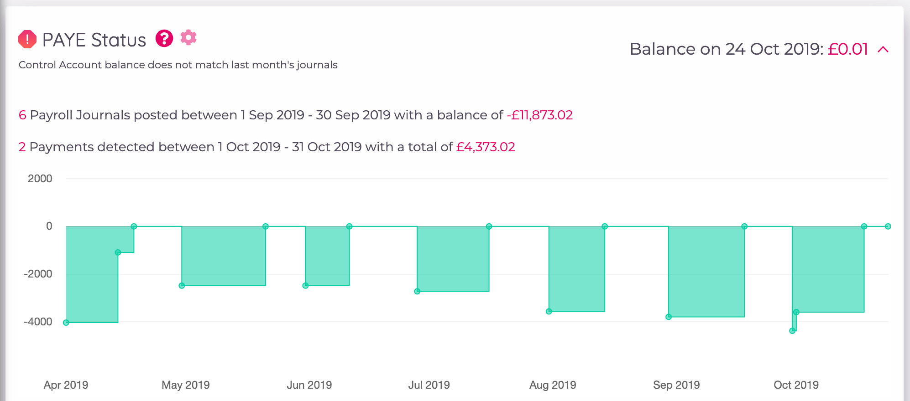
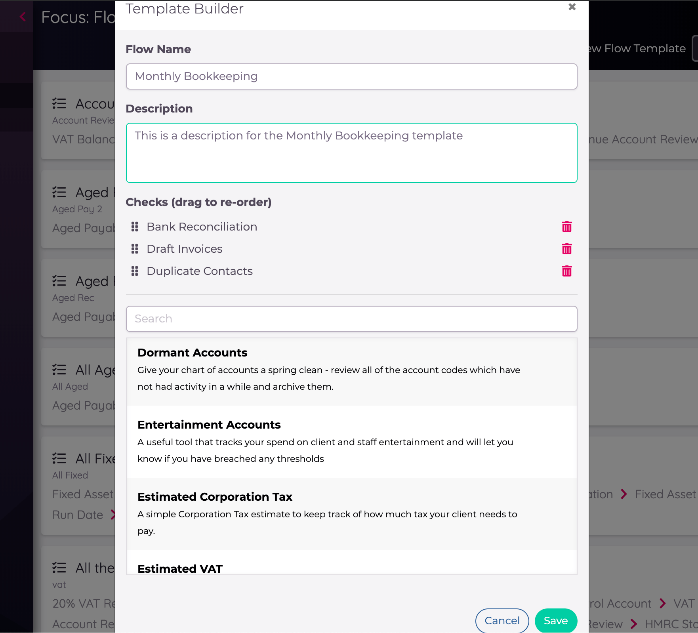
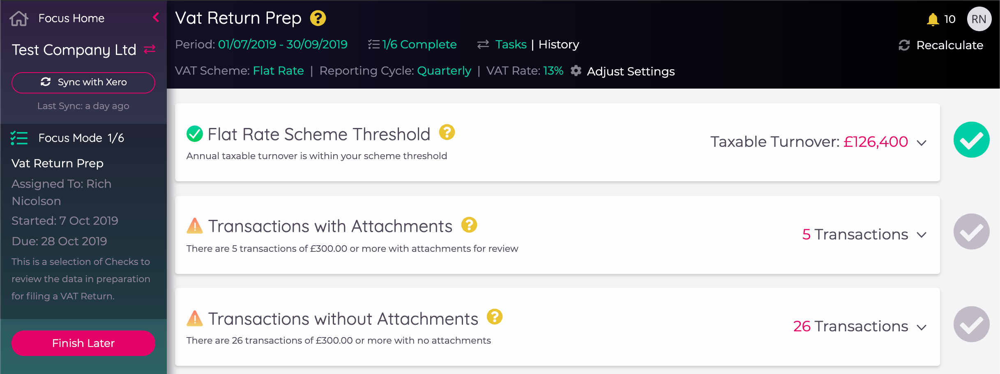
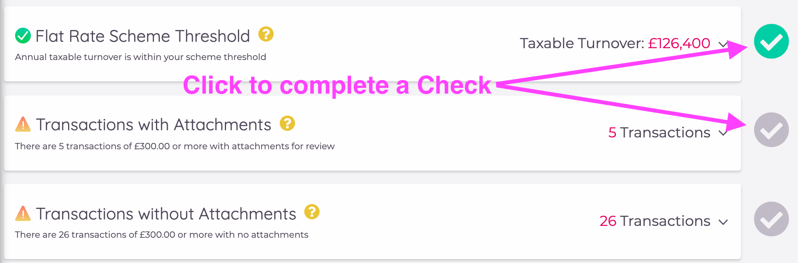

---

---
# Focus

Xavier Focus allows you to select from a library of tools and build a workflow that suits the business processes you
have developed around specific accounting jobs such as Tax Returns, Monthly Bookkeeping or Year End. 

Short on time? Check out our video as a quickstart:

<iframe width="560" height="315" src="https://www.youtube.com/embed/MnBT8GZxLuQ" frameborder="0" allow="accelerometer; autoplay; encrypted-media; gyroscope; picture-in-picture" allowfullscreen></iframe>

## Focus Glossary

- [Check](/focus.html#checks): A tool or task in Xavier, typically with a set of calculated results 
- [Custom Check](/focus.html#custom-checks): A user-defined Check for directing to non-Xavier tasks
- [Flow Template](/focus.html#flow-templates): a selection of Checks in a specific order, that can be assigned to a Flow
- [Flow](/focus.html#inside-a-flow): a Flow Template linked to a Client, User and Reporting Period, with a Due Date
- [Flow History](/focus.html#flow-history): an audit trail of progress on a Flow 

## Checks

Xavier tackles all sorts of accounting insights, and spots many kinds of errors. These are organised into Checks,
which you can think of as individual tools or tasks that require review by someone.  

If the Check has a down-arrow on the right-hand-side, then it can be expanded to show more detailed information by 
clicking on the card:

Some Checks have additional configuration options that can be adjusted while you are in Flow Mode. These Checks have
cog icons beside their title. Clicking on the cog will bring up the options that can be adjusted:

Sometimes if a Check raises an alert then you are prompted to take action and fix whatever Xavier has found to be
the issue. Focus provides a library of these Checks that can be combined together into
[Flow Templates](/focus.html#flow-templates).    

## Custom Checks

There's often non-Xavier tasks that you'd like your team members to work on during jobs like Management Reporting or
Year End. That's where Custom Checks come in. You can create your own Custom Checks that can be added to any Flow
Template you like. You can also include links in the description of the Check so your colleagues know where to go, by
highlighting a word:

## Flow Templates

A selection of Xavier's Checks can be combined together in a logical order into _Flow Templates_, designed for guiding
your colleagues through a specific job without needing to build lengthy internal process documents. Flow Templates can
be built on-the-fly when creating a Flow, at which point you can decide whether you only need the template once or you'd
like to save the template for re-use. They can also be created from the Flow Templates view.

Once multiple Checks have been added to a template they can be re-ordered by dragging and dropping.  

## Creating Flows

Creating a Flow involves assigning a Flow Template to one or more Clients, assigning a team member to the Client, and
selecting a reporting period and a due date for when the Flow needs to be completed. You can select a pre-existing 
[Flow Template](/focus.html#flow-templates), or build your own as you go.

::: tip
If you add multiple Clients when building a Flow, a Flow will be created for each Client.
::: 

In the final step, if any of the Checks require your input to specify additional parameters, you will be prompted to
provide these before Saving the Flow.

If you are creating the Flow for just one Client there will also be the option to "Save & Start". This provides a
shortcut where the Flow will be both created and started in one go, and you will be taken directly into
[Flow Mode](/focus.html#inside-a-flow).  

## Reviewers

Flows in Xavier can have up to two reviewers which you assign when creating the Flow. These reviewers are sent an email 
when the Flow is ready for review, starting with the first reviewer, who can either hand it back to the assigned user with 
any comments, or pass it on to the second reviewer (if assigned). The Flow can only be marked as complete once approved 
by the reviewer(s). Details of the reviewers and status are listed in the sidebar in Focus Mode.

## The Flow List

The Flow List shows all Flows for your team, and provides various filters to quickly find the Flows you are looking for.
You can filter Flows by their status (Not Started, In Progress, Complete), and order by different values such as Due 
Date and Period End. Use the search box to filter based on the Flow Template name. If the Flow is not yet completed,
warnings will be displayed as the Due Date set for the Flow is approaching.

There are options available for each Flow by clicking on the menu on the right of the card. **Note** that Flows that have
been started cannot be edited.

  

::: tip
A version of the Flow List is available when viewing an individual Client too, which is automatically filtered to Flows
for that Client.
:::

## Inside a Flow

When you click on a Flow, you are taken to a special "Flow Mode", which hides the distractions of the rest of Xavier and
allows you to focus on the job at hand. From here you can run through the Checks in a logical order and mark each one as
complete once you are happy.

  

From the left hand menu you can head back to the [Flow List](/focus.html#the-flow-list) by clicking on _Focus Home_, and
go to the Client Overview by clicking on the name of the Client. 

### Exporting a Flow

You can export a Flow to both PDF and Excel. The PDF is an export with the health score and top-level check information, 
plus the comments. The final section of the export is the [Flow History](/focus.html#flow-history). 

Regular Flows will 
export directly to your browser, like the other PDF exports in Xavier, however large Flows of 25+ checks will be emailed 
to the email address of the exporter (this is the email address you use to log into Xavier). This will still use the same 
'Export to PDF' button, but you'll get a pop-up notification to let you know if it's been emailed. Please bear in mind; 
the larger the Flow, the more time it will take to be emailed to you, so it could take more than a few minutes in some 
cases.

The Excel export contains the same data as the PDF, but simply formatted and always downloaded immediately to the browser. 
It's a good format if you want to create your own Flow export layouts, or edit the information before you provide it to 
the client. 

## Completing Flows

Progress is made on a Flow by completing Checks. This is done by clicking on the ticks beside each Check: 

  

If needed, you can click the tick again to change the Check back to incomplete. Only once you've completed all Checks
will Xavier allow you to mark the Flow as _Complete_:

  

::: warning
Once a Flow is completed this cannot be reversed, so make sure you're happy with all the Checks before performing this
final step.
:::

## Flow History

Xavier tracks the progress of a Flow via an audit trail called _Flow History_. In the "History" view of the Flow you
can see key events for the Flow laid out in a timeline:

  

This includes events such as a user rolling back a completed Check. A snapshot of the 
[Health Score](/clients.html#client-health-score) is also captured at the time of these events, so you can track the 
improvement of this over the course of the Flow. 

