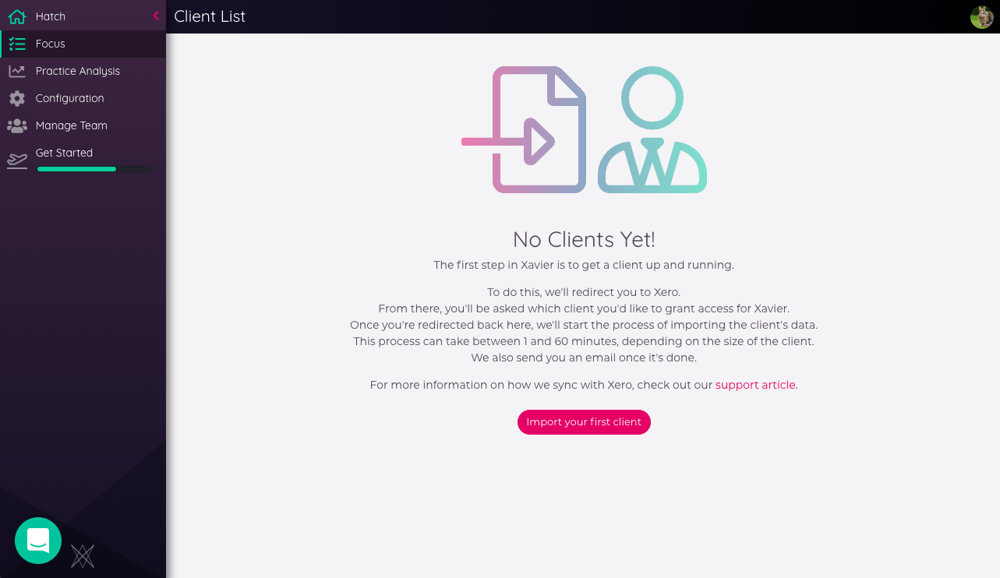

---

---
# Getting Started

Prefer video? Check out our recent overview webinar:

<iframe width="560" height="315" src="https://www.youtube.com/embed/IaJNcmeHXkA?rel=0" frameborder="0" allow="autoplay; encrypted-media" allowfullscreen></iframe>

We've also got a series of video tutorials on the _Learn_ section of our site: [https://xavier-analytics.com/learn/](https://xavier-analytics.com/learn/)

## Registration

When you sign up to Xavier you're asked to provide a team name. This is because we've designed Xavier from the ground up
to work well in a team environment - clients and shared reports can all be accessed by team members, so no wheels need
reinventing.

Think your company may already have a Xavier team? Drop your organiser a line and ask for an invite. In case they don't
know how to do this, you can share this help link with them:

[https://help.xavier-analytics.com/team-management.html#inviting-team-members](/team-management.md#inviting-team-members)

## Adding Your First Client

It all kicks off in Xavier when you add your first client. A _Client_ in Xavier is linked to an _Organisation_ in Xero.

After you register you'll be taken to the home page. This is where your team's clients will live once they've been imported from Xero.

Clicking _Import your first client_ will take you to Xero. You'll be asked to login if you haven't already:

And then you'll be asked to select and/or confirm the Xero organisation you want to connect to Xavier:

After allowing Xavier access, you'll be redirected back to Xavier, where the initial sync process will begin.
This can take between 1 and 45 minutes depending on the size of the client.

Once the initial sync is finished, your client is ready for analysis - go forth!

Learn more about our interaction with Xero [here](/xero-integration.md).

Having issues adding your first client? Check out our [troubleshooting tips](/troubleshooting.md).

Once you've got a client added, click on through to the [Client Overview](/clients.md#client-overview)
