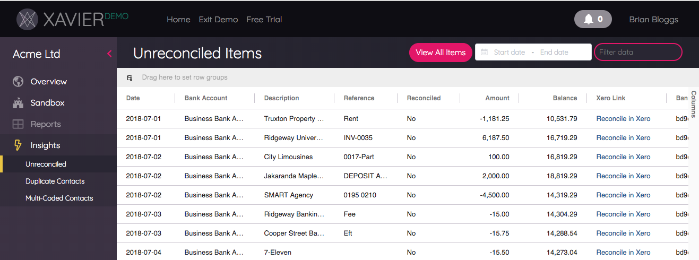
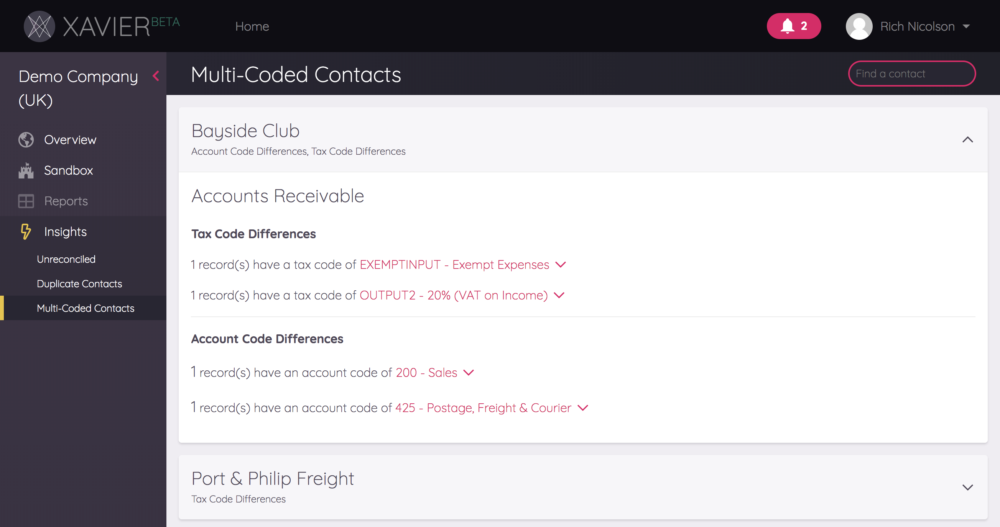
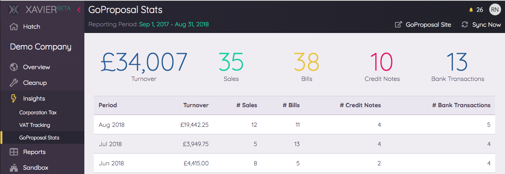

# Insights
In addition to allowing you to slice and dice your Client data, Xavier applies a number of its own data analysis
techniques and presents the findings up as *Insights*...

## Unreconciled Transactions

Xavier lets you view a client's unreconciled bank transactions. It uses Xero's Bank Statement Report data to do so.
From each record, you can click straight into Xero to start the reconciliation process. This insight allows you to
quickly order by the oldest records (useful if you are approaching month end), and also see/filter/group the records
that are in a "locked" period.

You can also hit the *View All Items* button at the top of the insight to work with all bank statement records, not just
the unreconciled ones.

Xero guidance on bank reconciliation can be found [here](https://central.xero.com/s/article/Bank-reconciliation-in-Xero).

## Duplicate Contacts

The results shown in this Xavier insight are your Xero contacts that we’ve identified as potential duplicates.
This can happen if you create a new contact during the process of inputting an invoice or similar, and miss the fact that
the contact already exists.

Review these, (soon you'll be able to dismiss any incorrect suggestions), and click on the Xero links for the contacts
you want to amend.

Xero guidance on merging contacts can be found [here](https://central.xero.com/s/article/Edit-or-merge-an-existing-contact).

## Multi-Coded Contacts

Each Invoice and Bank Transaction line item is assigned an Account Code and a Tax Code in Xero.
The majority of the time, these codes *should* be consistent for a given supplier or customer.

It happens to be best of us though - sometimes these records are assigned the wrong codes, or coding evolves over time.
We’ve crunched the numbers to find these potential mis-codings and you'll see them presented in this insight, with helpful
links directly to Xero allowing you to amend these where needed.

Xero provides a dedicated mechanism for re-coding, and their support documentation on this is 
[here](https://central.xero.com/s/article/Find-Recode-a-group-of-transaction-lines).

## Contact Defaults
Contacts in Xero can be setup with "default" account codes for sales and purchases. If set, Xero will use these to 
pre-populate the account code fields during bank statement reconciliation. For contacts that your client has
a recurring relationship with (e.g. a supplier that bills monthly), setting these defaults in Xero can dramatically 
speed up the reconciliation process:

Figuring out what contacts are eligible for setting up a default code in Xero can be time consuming. This Xavier system 
analyses each contact's transaction history and searches for contacts where either sales or purchase invoices have been 
consistently assigned the same account code, and presents these up to you in a handy list: 

You can review the transaction history of these contacts and decide whether or not to apply Xavier's suggestion.

Dismissing the suggestion will hide it from the "Suggested" list, but you can always undo this from the "Dismissed" list if 
you want it back.

Clicking *Set as default* does what is says on the tin - Xavier will prompt you to confirm before setting the suggested
account code in Xero as the default for either Sales or Purchases:

Xero's support documentation on settings for Contacts is [here](https://central.xero.com/s/article/What-are-contacts-in-Xero-UK).

## Corporation Tax

The Corporation Tax insight gives an estimate of the corporation tax accrued by a company for the current and previous 
financial years, based on UK tax rates and using the financial year-end dates in the Xero settings.

In terms of how the different elements are calculated, Xavier starts your team off with some defaults based on the chart 
of account's [Account Type](https://central.xero.com/s/article/Components-of-an-account-in-your-chart-of-accounts-AU?userregion=true)
and the  [Reporting Codes](https://central.xero.com/s/article/Report-codes-for-practices-using-report-templates) 
provided by Xero. 

### Client-specific configuration
Reporting Codes are applied to all Accounts, and can be customised in Xero by your team. They are a great way of 
achieving reporting consistency across clients that have different chart of account configurations. But you only have 
visibility of Reporting Codes if you are a Xero Partner, and sometimes it is not feasible to configure these for every 
client you work with. 

Xavier allows you to override the default corporation tax calculation for a client. By clicking on the cog beside an 
element of the corporation tax view you will see what is currently being used for that section of the calculation. 

Clicking "change" allows you to specify individual account codes to either include or exclude, depending on the section: 

Specifying account codes means that the default calculation will no longer be used for this client, and Xavier will 
instead use the account codes provided. Upon clicking *Save*, the corporation tax will be recalculated for current and
previous years based on the new configuration.

You can remove account codes from the calculation at any time, and removing all of them will result in the calculation 
reverting back to using the Xavier defaults.

## VAT Tracking

The VAT Tracking insight gives an estimate of the VAT accrued by a company for the current VAT period, and includes 
estimates for previous periods dating back to the end of the previous financial year. The financial year and VAT periods 
are based on the client's settings in Xero.

### Cash vs Accrual Schemes
In the UK, a company could be configured to report VAT to HMRC on a Cash basis or an Accrual basis. Xavier automatically 
detects this based on Xero settings and adjusts the VAT calculation accordingly.  

### Flat Rate Scheme
Xavier will detect if a client is on a [Flat Rate Scheme](https://www.gov.uk/vat-flat-rate-scheme/how-much-you-pay), but 
it has no way of knowing what VAT rate has been agreed with HMRC for the client. The first time you view the VAT Tracking
insight, Xavier will prompt for the VAT rate to use if it detects the client is on a Flat Rate Scheme:

 
You can adjust this for a client at any time by clicking on *Adjust Rate* in the menu bar of the VAT view.

### Scheme Thresholds
For the Cash and Flat Rate schemes, Xavier monitors your 
[taxable turnover](https://www.gov.uk/vat-registration/calculate-turnover) to ensure that you remain on the right 
scheme from a compliance perspective, using HMRC's defined [thresholds](https://www.gov.uk/vat-registration-thresholds).

For example, you'll get an alert at the top of the VAT insight if you exceed a threshold:

And similarly Xavier also warns you if you are approaching a threshold:

      

### Payment Detection
Xavier will try and detect if a previous period's accrued VAT has been paid to HMRC or not, by searching for reconciled 
bank transactions within 6 months of the end of the period, with:
- a GL Account with the Reporting Code of `LIA.CUR.TAX.VAT`
- a payment amount within a 2% variance of the estimated amount for the period

If such a payment is found, the *Payment Detected* field will be set to "Yes". Clicking on this will take you straight 
through to the bank transaction in Xero.

## GoProposal Stats

Designed for accountancy firms utilising [GoProposal](https://goproposal.com/) to determine pricing for their clients, 
the GoProposal Stats insight gives a breakdown of the key trading statistics of a company, with a focus on volume, e.g. 
number of bank transactions for the period. These figures can then be input directly into GoProposal to quickly 
calculate pricing when a client is up for renewal.

This insight calculates statistics for a rolling 12 month period, starting from the last complete month, and working 
back from there.

## Historical Changes

Have you ever had that uncomfortable feeling that something in a previous period has changed after you've reported it to
the board or to the tax authorities? All the accountants we know have run into this at some point. Everyone makes 
mistakes, and it can be quite easy for someone with Advisor privileges in Xero to create a record with the wrong journal 
date. 

The tricky thing is tracking down these changes so they can be amended. Xavier allows you to identify exactly what was 
changed and when within seconds. Simply input the historical reporting period that you want to check, and the close date 
from which you expect no more transactions to have been logged for that period, and click *Run Report*.

Xavier queries the underlying journal transactions for the client, and looks for transactions that have a journal date 
within the historical period, but a created date of __after__ the reporting close date. 

You'll be able to jump straight to the offending transaction(s) in Xero from the results. And, in case you need to show 
someone else where it all went wrong, you can always export the results to PDF. 
