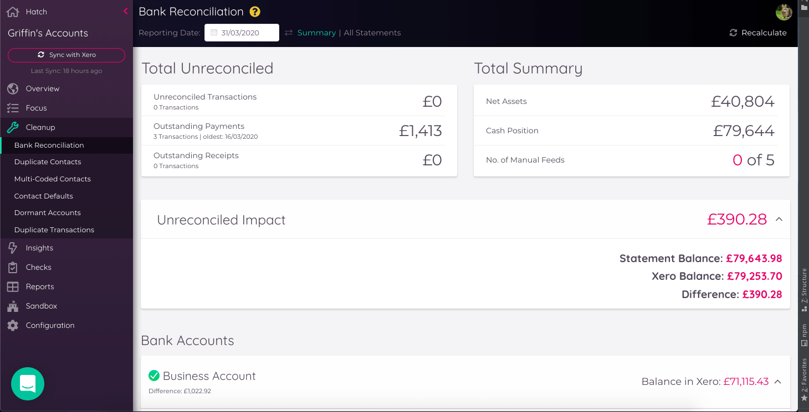
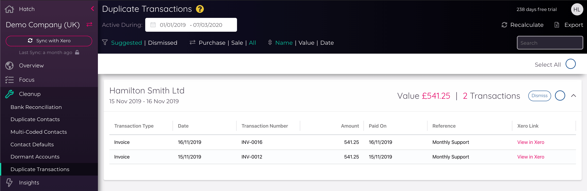
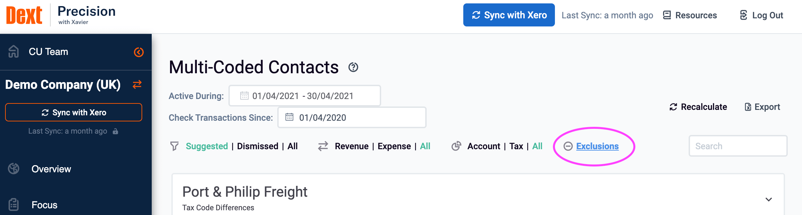
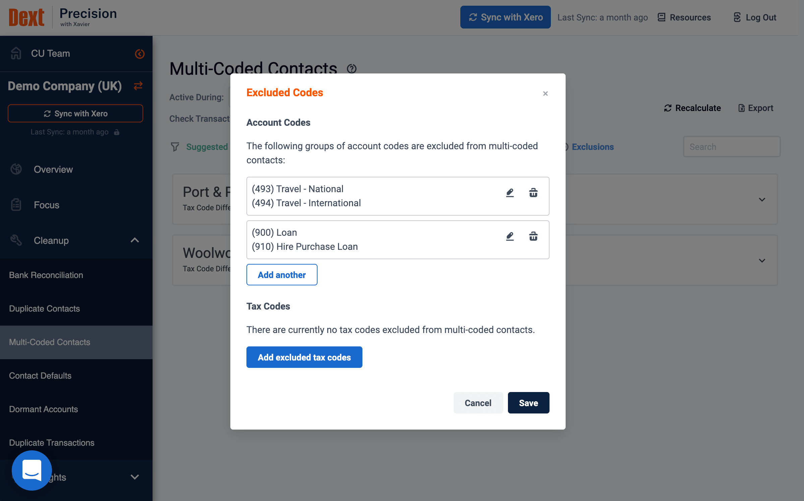

---
---

# Insights
In addition to allowing you to slice and dice your Client data, Dext Precision applies a number of its own data analysis
techniques and presents the findings up as *Insights*...

## Bank Reconciliation

::: warning Please note:
Bank Reconciliation is currently available for Xero clients only.
:::

Dext Precision uses a combination of Xero's Bank Statement Report data, bank transactions and payments to provide an
interactive view across all of an organisation's bank accounts. The format loosely follows Xero's Bank Reconciliation
Report, distinguishing between outstanding payments, receipts and unreconciled bank statement lines.

### Bank Account Summary

#### Total Unreconciled
This is the total number of unreconciled transactions, outstanding payments and outstanding receipts across all bank 
accounts. Below the summary boxes is also a card for the full _Unreconciled Impact_ - this card will display 
the difference between the _Statement Balance_ and the _Xero Balance_ (you can click on the card for the detail).   

#### Net Assets
The Net Assets figure is a calculated balance of all transactions with the **Account Class** of _ASSET_ minus all
transactions with the **Account Class** of _LIABILITY_, up the the reporting date. This figure is also available as a
metric on the [Client List](/clients.html#client-list) and [Practice Dashboard](/clients.html#practice-dashboard). Xero
Account Classes are shown below:

#### Cash Position
The Cash Position figure is a consolidated statement balance of all bank accounts, on the reporting date set. This
figure is also available as a metric on the [Client List](/clients.html#client-list) and
[Practice Dashboard](/clients.html#practice-dashboard).

::: tip
Foreign bank account balances are converted to the base currency to produce this number - use as a guideline only, where
this is a factor, and see below for more info.
:::

#### No. of Manual Feeds
Dext Precision detects which Bank Accounts are updated with Manual Feeds. The number of manual feeds is displayed in the summary, 
and those Bank Accounts will also have a small pink _broken_ chain indicator next to their names in the cards below. 

Bank accounts detected to have a working bank feed will have a small pink _linked_ chain indicator next to their names. 
(You can hover over the indicator for more information.) 

### Bank Accounts

Each Bank Account is contained within a card. Expanding this card displays three unreconciled categories; _Outstanding Payments_, 
_Outstanding Receipts_ and _Unreconciled Statement Lines_. 
Expanding one of these categories allows you to see transaction-level detail in a flexible grid view. From each record,
you can click straight into Xero to start the reconciliation process. The grid allows you to quickly order by the
oldest records (useful if you are approaching month end), and also see/filter/group the records that are in a "locked"
period.

### Foreign Currency Bank Accounts
Precision detects when a bank account is in a different currency to the base currency of the organisation, and displays
accordingly. There's a toggle that allows you to view the reconciliation totals for a bank account in either the native
currency of the bank account or the base currency of the organisation.

::: tip
Dext Precision uses an independent exchange rate service, so the base currency calculated balances for a foreign currency
may not always totally match up to the reports in Xero or QBO - use as a guideline only.
:::

More about exchange rates in Xero can be found in their
[support documentation](https://central.xero.com/s/article/View-exchange-rate-or-conversion-rate).

### All Bank Statements
You can also hit the *All Statements* button at the top of the insight to work in a full sandbox-style grid with all
bank statement records, not just the unreconciled ones.

Xero guidance on bank reconciliation can be found [here](https://central.xero.com/s/article/Bank-reconciliation-in-Xero).

## Duplicate Contacts

The results shown in this Precision insight are your contacts (suppliers or customers) that we’ve identified as potential duplicates.
This can happen if you create a new contact during the process of inputting an invoice or similar, and miss the fact that
the contact already exists.

Review these, you may dismiss any which are not true duplicates, or for Xero clients, clicking the name of the contact will take you to Xero 
to amend them. The transaction count should give a good indication of which contact has had more activity.

Xero guidance on merging contacts can be found [here](https://central.xero.com/s/article/Merge-contacts).
QuickBooks Online guidance on merging contacts can be found [here](https://quickbooks.intuit.com/learn-support/en-uk/manage-customers/how-to-merge-accounts-customers-and-suppliers/00/239118).

### Dismissals
Each duplicate contact can be 'dismissed' - this means that Precision will no longer count that combination of client names
to be a potential duplicate. Dismissed items do not contribute to the [Health Score](/clients.html#client-health-score).
Any dismissed duplicates can be viewed by selecting *dismissed* from the filter at the top
of the screen, where you can then review and *undo* any accidental dismissals.

You can dismiss multiple duplicates at a time by selecting '_Select All_' above the list, or by using the circular checkbox 
on the right of the card (on the right of the _Dismiss_ button) on all duplicates you would like to dismiss, and then click 
'_Dismiss (X) Suggestion(s)_'.  

## Duplicate Transactions

Here Precision looks across invoices and bank transactions and highlights records that it thinks could be unwanted duplicates. 
This view allows you and your clients avoid embarrassing situations where you might inadvertently pay a supplier twice, 
or charge a customer twice. You can filter the check between _Purchase_ and _Sales_ transactions, and sort by contact _Name_, 
transaction _Value_ or _Date_.

Each detected duplicate is presented in a card for the combination of Contact and Value (in this case, it is good to ensure 
your Duplicate Contacts are all cleaned up). Clicking on this card to expand it will show the transactions in a grid format 
with further information on the type, source and description. For Xero clients, you can then click the links in this grid to see the transaction 
or invoice directly in Xero.

The Alert level on the Overview refers directly to the number of duplicate transactions relative to the total number of 
transactions in the reporting period.

#### Sales Transactions

Duplicate sales transactions result in overstated revenue and unnecessary chasing of customers that have already paid. 
This can happen due to human error accidentally raising invoices that have already been raised, or from integrations with 
another system that can sometimes incorrectly pull in duplicates.  

#### Purchase Transactions

Duplicate purchase transactions can result in serious mistakes such as paying a supplier twice. Expenses might also be 
overstated for the period. Additionally, paid transactions sitting in Aged Payables are messy and can reflect badly on 
the standards of the accountant or bookkeeper. These can occur when there is a purchase invoice duplicate based on the 
same criteria as a sales invoice, or when the invoice is an Aged Payable, but reconciled in the bank using 'create transaction', 
creating both a bank transaction and an invoice against the same item. 

### Dismissals
Dismissing duplicate transactions means that Precision will no longer count that combination of invoices and transactions for that contact
to be a potential duplicate. Dismissed items do not contribute to the [Health Score](/clients.html#client-health-score).
Any dismissed duplicates can be viewed by selecting *dismissed* from the filter at the top
of the screen, where you can then review and *undo* any accidental dismissals.

You can dismiss multiple duplicates at a time by selecting '_Select All_' above the list, or by using the circular checkbox 
on the right of the card (on the right of the _Dismiss_ button) on all duplicates you would like to dismiss, and then click 
'_Dismiss (X) Suggestion(s)_'.  

## Multi-Coded Contacts

Each Invoice and Bank Transaction line item is assigned an Account Code and a Tax Code in your GL.
The majority of the time, these codes *should* be consistent for a given supplier or customer.

It happens to be best of us though - sometimes these records are assigned the wrong codes, or coding evolves over time.
We’ve crunched the numbers to find these potential mis-codings and you'll see them presented in this insight, and for Xero clients we provide helpful
links directly to Xero allowing you to amend these where needed.

Xero provides a dedicated mechanism for re-coding, and their support documentation on this is
[here](https://central.xero.com/s/article/Find-Recode-a-group-of-transaction-lines).

### Selecting The Date Filters
The Multi-Coded Contacts insight allows you to specify two different date filters:

**Active During**: This is the period where you want to find contacts to assess. Precision will find and evaluate contacts
that have been active (i.e. they have transactions) during this time period. For example, this could be your reporting
period of the previous month.

**Check Transactions Since**: Once Precision finds the active contacts to evaluate, this date refers to how far back in
time Precision should look into each Contact's transaction history to compare account and tax codes and surface any
inconsistencies. For example, if you know that you changed your accounts structure at the start of the year, it doesn't
make sense to evaluate transaction history before the change, so set this date to be the 1st of January (or whenever
you made the change).

### Narrowing The Scope

The Multi-Coded Contacts insight allows you to get really targeted with the data cleanup process, and quickly filter out
any suggestions that don't make sense for your situation.

**Revenue | Expense | All**: Restrict the suggestions list to only transactions relating to Revenue OR Expenses.

**Account | Tax | All**: Restrict the suggestions list to only transactions Precision has identified with Account Code
anomalies, OR Tax Code anomalies.

#### Exclusions
Typically, transactions with a single contact will only have one associated account code, with a small number of exceptions. 
However in some cases, a contact will always have multiple account codes against it, such as a sale to a contact that pays 
shipping as a separate transaction. Exclusions allow you to specify combinations of account codes that you feel should not 
be detected as errors for a given client.

Contacts that have the combination of account or tax codes included in the Exclusion list will no longer appear as detected 
Multi-Coded contacts. If a Contact has multiple codes on other transactions they will appear in the multi-coded contacts 
view, but only the transactions relating to combinations of codes outside the exclusion list will be displayed

#### Setting Exclusions

Using the ‘Exclusions’ button at the top of the multi-coded contacts screen, you will be shown a list of current excluded 
account or tax code combinations. 

You can use this list to add, edit or remove a tax or account code combination from the exclusions list. 

To add a combination to the exclusions list, click the ‘add’ button under the account or tax code category. From here you can search 
for and select the combination of codes you would like to exclude. You must select two or more codes to exclude. This 
combination of codes will apply as an exclusion across all contacts for that client. 

Combinations of account or tax codes can be added or removed from the exclusion list at any time from the Multi-Coded 
contacts tool.   

::: warning Please note:
Exclusions only apply at the Client level - any exclusions set for a client will not apply to other clients in the Precision team.
:::

### Understanding the Colour-Coding
Precision adds colour to the transaction rows to provide a clear indication as to which transactions fall into the "Active
During" period and which ones are historical:

#### Dismissals

If there is good reason for the different coding, then you can dismiss the multi-coded alert and it will not show again.
Any dismissed alerts can be viewed by selecting *dismissed* from the filter at the top of the screen, where you can then 
review and *undo* any accidental dismissals. Dismissed items do not contribute to the [Health Score](/clients.html#client-health-score).

This dismissal applies to a few levels below the contact, taking into account both *direction* (Payable/Receivable) and
whether they are *Tax Code* or *Account Code* differences.

For example, you can dismiss an alert for a contact with differences in receivable account codes, and we won't raise any
more alerts for additional receivable account codes placed against that contact, but you will still get an alert for that
client if we detect multiple *payable* account code differences, or multiple receivable *tax codes*.

## Contact Defaults

::: warning Please note:
Contact Defaults is currently available for Xero clients only.
:::

Contacts in Xero can be setup with "default" account codes and tax types for sales and purchases. If set, Xero will use these to
pre-populate the account code or tax type fields during bank statement reconciliation. For contacts that your client has
a recurring relationship with (e.g. a supplier that bills monthly), setting these defaults in Xero can dramatically
speed up the reconciliation process:

Figuring out which contacts are eligible for setting up these defaults can be time consuming. This Precision system
analyses each contact's transaction history and searches for contacts where either sales or purchase invoices have been
consistently assigned the same account code or tax type, and presents these up to you in a handy list:

You can review the transaction history of these contacts and decide whether or not to apply Precision's suggestion.

Clicking *Set as default* does what is says on the tin - Precision will prompt you to confirm before setting the suggested
code in Xero as the default for either Sales or Purchases:

Xero's support documentation on settings for Contacts is [here](https://central.xero.com/s/article/What-are-contacts-in-Xero-UK).

### Dismissals

If you think the suggested default is not suitable, you can dismiss it. Any dismissed suggestions can be viewed by selecting
*dismissed* from the filter at the top of the screen, where you can then review and *undo* any accidental dismissals.
Dismissed items do not contribute to the [Health Score](/clients.html#client-health-score).

The dismissal covers the combination of contact name and the type of suggested account code; account code or tax type. If you
dismiss a suggested account code default for a contact, for example, you will still be suggested potential default tax
types if one becomes suitable.

## Dormant Accounts
This view identifies GL Accounts that have not had any transactional activity recorded against them from the "Dormant
Since" date you supply.

You can review the transaction history of these accounts and decide whether or not to take action on Precision's suggestion.
The idea is to help you identify old account codes that could be cleaned up, either through archiving or deleting, for
better reporting.

You can filter and sort to look at accounts with transactional history (activity) and also by Account Class. Precision
won't show you System Accounts and certain other Accounts as they cannot be archived.

For each account suggested by Precision, you can either archive it, or dismiss it. Archiving the suggestion makes the
appropriate change in your GL. Dismissing the suggestion will hide it from the "Suggested" list, but you can always undo
this from the "Dismissed" list if you want it back.

For Xero clients, you can also follow the link to Xero's Chart of Accounts to restore an archived account or delete one. Read more on
[managing account codes in Xero](https://central.xero.com/s/article/Delete-archive-or-restore-an-account-in-your-chart-of-accounts).

### Dismissals
Each account code can be 'dismissed' if you're not ready to take action and do not want Precision to raise it again.
Dismissed items do not contribute to the [Health Score](/clients.html#client-health-score).
Any dismissed account codes can be viewed by selecting *dismissed* from the filter at the top
of the screen, where you can then review and *undo* any accidental dismissals.

## Corporation Tax

::: warning Please note:
Estimated Corporation Tax is currently available for Xero clients only.
:::

The Corporation Tax insight gives an estimate of the corporation tax accrued by a company for the current and previous
financial years, based on UK tax rates and using the financial year-end dates in the Xero settings.

In terms of how the different elements are calculated, Precision starts your team off with some defaults based on the chart
of account's [Account Type](https://central.xero.com/s/article/Components-of-an-account-in-your-chart-of-accounts-AU?userregion=true)
and the  [Reporting Codes](https://central.xero.com/s/article/Report-codes-for-practices-using-report-templates)
provided by Xero.

### Client-specific configuration
Reporting Codes are applied to all Accounts, and can be customised in Xero by your team. They are a great way of
achieving reporting consistency across clients that have different chart of account configurations. But you only have
visibility of Reporting Codes if you are a Xero Partner, and sometimes it is not feasible to configure these for every
client you work with.

Dext Precision allows you to override the default corporation tax calculation for a client. By clicking on the cog beside an
element of the corporation tax view you will see what is currently being used for that section of the calculation.

Clicking "change" allows you to specify individual account codes to either include or exclude, depending on the section:

Specifying account codes means that the default calculation will no longer be used for this client, and Precision will
instead use the account codes provided. Upon clicking *Save*, the corporation tax will be recalculated for current and
previous years based on the new configuration.

You can remove account codes from the calculation at any time, and removing all of them will result in the calculation
reverting back to using the Precision defaults.

### Capital Allowances
The _Capital Allowances_ section of the Corporation Tax insight uses the Fixed Assets register in Xero to look for
registered assets purchased during the date period. It specifically looks for:

- Fixed Assets with a status of "Registered" (i.e. Draft won't count)
- Fixed Assets with a purchase date that falls within the start and end dates you've set at the top of the Corporation
Tax view

### Scheme Thresholds

::: warning Please note:
Our VAT tools are currently available for Xero clients only.
:::

For the Cash and Flat Rate schemes, Precision monitors your
[taxable turnover](https://www.gov.uk/vat-registration/calculate-turnover) to ensure that you remain on the right
scheme from a compliance perspective, using HMRC's defined [thresholds](https://www.gov.uk/vat-registration-thresholds).

For example, you'll get an alert at the top of the VAT insight if you exceed a threshold:

And similarly Precision also warns you if you are approaching a threshold:

### Payment Detection
Precision will try and detect if a previous period's accrued VAT has been paid to HMRC or not, by searching for reconciled
bank transactions within 6 months of the end of the period, with:
- a GL Account with the Reporting Code of `LIA.CUR.TAX.VAT`
- a payment amount within a 2% variance of the estimated amount for the period

If such a payment is found, the *Payment Detected* field will be set to "Yes". Clicking on this will take you straight
through to the bank transaction in Xero.

## Fixed Assets

::: warning Please note:
Our Fixed Asset tool is currently available for Xero clients only.
:::

Fixed Assets are a somewhat separate part of the Xero system, which can lead to some inconsistencies. Precision connects to
the Fixed Assets register in Xero and compares it with the general accounting ledger to highlight where records may be
out of sync.

### Fixed Asset Accounts
Dext Precision looks at general ledger Accounts that have an Account Type of _FIXED_, and then looks for mapped Asset
Types in the Fixed Asset register. Accounts need to be selected as the Fixed Asset Account, Depreciation Expense Account
or Accumulated Depreciation Account of at least one Asset Type to be considered "mapped".

Precision then checks the balance of any unmapped Accounts - if any are non-zero then this should be considered a genuine
issue that needs immediate attention.

### Draft Assets
Dext Precision searches the fixed asset register for draft assets and lists them here for convenience. This section is a good
place to start if the asset types are not reconciling in the section above.

### Fixed Asset Account Reconciliation
This section cycles through all of the accounts in Xero's general ledger that are specified as the *Fixed Asset Account*
in the Fixed Assets register. It  compares their balance with the combined totals of the *Purchase Price* of all assets
associated with it, up to the Reporting Date, and highlights any that don't match. You can expand
each Asset type to compare transaction history of the Account with the Asset activity.

### Depreciation Account Reconciliation
Similar in logic to the Fixed Asset Account Reconciliation, this section cycles through all of the accounts in Xero's
general ledger that are specified as the *Accumulated Depreciation Account* in the Fixed Assets register. It  compares
their balance with the combined totals of the "Depreciation Value" of all assets associated with it, up to the Reporting
Date, and highlights any that don't match. The Depreciation Value is a calculation of the difference between the
*Purchase Price* and *Accounting Book Value* of an asset.

### Depreciation Run
This simple check compares the Reporting Period specified at the top of the insight with the "Last Depreciation Date" in
the Fixed Asset Register, and shows an error if they don't match.

## Aged Balances

The Aged Balances insight looks at aged Debtors (specifically bills) and Creditors (specifically invoices) at a snapshot in time.

### Setting Parameters
- **Reporting Date**: this is the point in time that you want to evaluate your debtors and creditors at, based on invoice
dates.
- **Invoice Age**: the age of the invoice in relation to the _Reporting Date_. For example, setting the _Invoice Age_ to
two months means Precision will only look at invoices that are dated older than two months from the Reporting Date.

### Aged Receivables
This surfaces your debtors, old invoices for people that owe you money. You can see a count of old invoices at a glance
and a sum of the total amount owed. Clicking on this card will expand to show the detail of each aged invoice. For Xero 
clients, there is a link straight to Xero if needed.

### Aged Payables
This surfaces your creditors, old invoices for people that you owe money to. You can see a count of old invoices at a
glance and a sum of the total amount you owe. Clicking on this card will expand to show the detail of each aged invoice. 
For Xero clients, there is a link straight to Xero if needed.

### Average Debtor Days
This uses a common ratio-based method to provide an indication of the length of time it takes for your debtors to pay
you. This is based on the total Receivable amount owed at the _Reporting Date_, and the gross revenue over the last 12
months up to the _Reporting Date_.

### Overpayments
The check allows you to review all overpayments that still have remaining credit available at the time of the
_Reporting Date_, by checking the dates of any allocations to make sure they are applicable. This is categorised into
Overpayments relating to Suppliers and Customers.

## Control Accounts

::: warning Please note:
Our Control Account tools are currently available for Xero clients only.
:::

All Control account checks use the following logic to decide the alert level: 
  - All is well: if the Control Account balance is 0 and there is a Manual or Xero Payroll Journal present in the last
  complete month
  - All is well: the Control Account balance is equal to the amount posted in the Manual or Xero Payroll Journal(s) in the
  last complete month, and (if relevant) the snapshot date is well in advance of the HMRC Deadline
  - Warning: Control Account and Journals balance, but a payment due date is approaching
  - Error: No Manual or Xero Payroll Journal found in the last complete month
  - Error: No payment detected, and a payment deadline is past due
  - Error: Control Account balance is non-zero and does not reconcile with balance of Manual or Xero Payroll journals

### PAYE Status

This check balances manual journals against detected payments with PAYE account codes to ensure a correct PAYE status at
a point in time.
By default, the check calculates the PAYE control account balance based on account codes found under the reporting code
*LIA.CUR.TAX.OTH*. You can change the account codes used by clicking the small cog next to the card title, where Precision 
will suggest a number of account codes for easy setup. Expanding the card shows the detailed grid of PAYE transaction 
history for the last 6 months.

### Net Wages Status
This check balances manual journals against detected payments with Net Wages account codes, to ensure that it reconciles 
to 0 or the balance is as expected. 

Similar to PAYE status above, you can change the account codes used by clicking the small cog next to the card title.   
Expanding the card shows a chart of money in and money out, and the detailed grid of Net Wages transaction history for 
the last 6 months.

### Pensions Status
This check balances manual journals against detected payments with Pensions account codes, to ensure that it reconciles 
to 0 or the balance is as expected. 

You can change the account codes used by clicking the small cog next to the card title. Expanding the card shows a chart 
of money in and out of the control account, and the detailed grid of Pensions transaction history for the last 6 months.

### Directors Loan Accounts

A Directors Loan is allowable in a UK business only up to £10,000; once the loan is over £10,000 the business is liable 
to high tax charges. This represents a significant pay point for the SME, and therefore a key area for accountants to advise. 
Accountants should therefore keep an eye on the DLA throughout the year. To help you with this, Precision creates an alert when 
a DLA exceeds the £10,000 mark. 

As per the other control accounts, Precision will show a graph of the history of the control account as well as the 
journals and payments detected in the previous month. 

The alert level relates to the extent to which the DLA is overdrawn: 
- If the DLA is overdrawn over the limit of £10,000, Precision will show a red alert. 
- If the DLA is overdrawn below £10,000, Precision will show an amber warning. 
- If the DLA is not overdrawn, with a positive balance, Precision will show a green check. 

To monitor multiple DLA accounts, you can select multiple account codes for this check, and each will appear as a separate 
card within the check with it’s own graph. 

## Activity Stats

Designed for accountancy firms utilising proposal tools such as [GoProposal](https://goproposal.com/) to determine
pricing for their clients, the _Activity Stats_ insight gives a breakdown of the key trading statistics of a company,
with a focus on volume, e.g. number of bank transactions for the period. These figures can then be input directly into
your proposal tool to quickly calculate pricing when a client is up for renewal.

By default, this insight calculates statistics for a rolling 12 month period, starting from the last complete month, and
working back from there. However, you can select a date range and Precision will do its best to segment your date range
into monthly slots.

### Understanding Turnover
The Activity Stats insight uses the following logic to determine the Turnover calculation:

The _NET_ value of all transactions in the selected date range that have an __Account Type__ of either _Revenue_ or
_Sales_.

::: tip
Note that the Account Type _Other Income_ is not included in this calculation.
:::

This gives you some flexibility in determining this Turnover figure, as the Account Type can be modified for each
account in your GL.

::: tip
Xero provide some documentation on working with
[Chart of Accounts](https://central.xero.com/s/article/Chart-of-accounts-in-Xero).
:::

## Historical Changes

::: warning Please note:
Historical Changes is currently available for Xero clients only.
:::

Have you ever had that uncomfortable feeling that something in a previous period has changed after you've reported it to
the board or to the tax authorities? All the accountants we know have run into this at some point. Everyone makes
mistakes, and it can be quite easy for someone with Advisor privileges in Xero to create a record with the wrong journal
date.

The tricky thing is tracking down these changes so they can be amended. Precision allows you to identify exactly what was
changed and when within seconds. Simply input the historical reporting period that you want to check, and the close date
from which you expect no more transactions to have been logged for that period, and click *Run Report*.

Dext Precision queries the underlying journal transactions for the client, and looks for transactions that have a journal date
within the historical period, but a created date of __after__ the reporting close date.

You'll be able to jump straight to the offending transaction(s) in Xero from the results. And, in case you need to show
someone else where it all went wrong, you can always export the results to PDF.

### Companies House Periods (UK Only)

For UK companies, using Companies House data we can pull back your last filing period and the date the accounts were filed 
in the secondary navigation. 
Use the 'Use these dates' option to auto-populate the Historical Changes insight with your last filing dates.

A metric will be shown in the Practice Dashboard to highlight where there has been any changes to filed data. 

::: tip
Dext Precision uses the Companies House number it detects in Xero to make this connection - if we can't display any data, check 
the Companies House number in Xero is correct and update if necessary.
:::

### Historical Changes Checks

::: warning Please note:
Historical Changes is currently available for Xero clients only.
:::

The Historical Changes check is also available in [Focus](/focus.html); for UK companies, this will be automatically populated as the 
last filing period, but it can also be adjusted during the Flow.

## Regular Suppliers
Regular Suppliers has now become *Cost Analysis*! See below...

## Cost Analysis

The Cost Analysis insight is designed to analyse your client's expenses across their supplier base and their expense accounts 
over time and automatically detect issues. Our AI will look for months where the total amount paid is unusual compared to other months.

Clicking a supplier or account will show a chart of amounts over time and highlight the periods where we have detected there
may be an issue. Clicking on a bar in the chart will explain the issue that we have found and show a summary of payments to the
supplier or account in the chosen period. You may then choose to dismiss the alert or go through to the GL to investigate.

### Regularity 

On each Supplier or Account Code card is an indicator on the right for Precision's best guess on the regularity of those 
payments to that supplier or account code, e.g. *weekly* or *monthly*. 

### Dismissals
Each anomalous period can be 'dismissed' if you have reviewed the period and do not want Precision to raise it again.
The card for that supplier or account will not be removed from the view until all anomalous periods in the chart have been dismissed.
Dismissed items do not contribute to the [Health Score](/clients.html#client-health-score).
Any dismissed periods can be viewed by selecting *dismissed* from the filter at the top
of the screen, where you can then review and *undo* any accidental dismissals.

### Filters

- *Display Mode* - Use the Display Mode to toggle between reviewing cost by *Supplier* and cost by *Account Code*. Both 
views work in exactly the same way, except for the categorisation of costs.
- *Active During* - Set this date parameter to view only suppliers or account codes active in a certain period. 
- *Anomalies | Dismissed | All Suppliers/Accounts* - Use this filter to view either all anomalies detected, all dismissed 
anomalies, or simply all account codes or suppliers, regardless of any anomalies or dismissals, for a full review. 

## Benchmarking

::: warning Please note:
   This feature is available for Xero clients only. If you have any questions, please just let us know! 
:::
  
Using the Benchmarking insight, Precision can benchmark both Turnover and Expenses for your clients, within their region, 
industry, or all other clients, either against your own practice or across a wider Precision dataset. 

The Region and Industry are based on Companies House data cross-checked against GL data (using a degree of AI matching) 
to select the best fit.

Benchmarking requires a minimum number of clients to provide our insights, or you will see the warning _'Not enough data 
for comparison. Try changing your filters.'_. 
This minimum client requirement also applies to the filters for the number of clients within the same Region and Industry.

You can benchmark within your practice, or against a wider Precision dataset. When benchmarking a client against wider Precision 
data (not just your own practice) the information is displayed as a heat map, rather than data points. 

Benchmarking data is presented graphically but we also provide statistics below the graph, e.g. _"Demo Company's expense is 
40% higher than other businesses for it's age."_.

## Sales Analysis

::: warning Please note:
   This feature is currently available for Xero clients only. 
:::

This feature allows you to review your client's revenue for a given period, breaking it down into who their key customers are and how
much revenue each of these customers generate.

### Accumulated Revenue
This chart demonstrates how much of your client's revenue comes from a smaller proportion of customers. The chart area
is cumulative; the steeper the curve is at the beginning, the more revenue is generated by that segment. The curve will
typically then level off, as later segments contribute less to the revenue total.

Revenue-generating contacts are listed in the grid below the chart, grouped by segment, with an indication of how reliant the client
is on that contact. By identifying these key revenue generating customers, you can give clients informed advice as to
where they should be focusing their time.

This grid lists a few key stats:
- _Customer_ is the contact name, and clicking on it will link to the contact in Xero
- _Revenue_ is the amount of revenue generated by that customer during the period
- _Transactions_ is the number of transactions generated by that customer during the period
- _Reliance_ is the percentage of total revenue which comes from that customer in the period
- _Debtor Days_ is a calculation of the time the customer typically takes to pay

### Average Monthly Revenue
Dext Precision then provides two key stats for the client; average monthly revenue for the period, and the average monthly revenue 
per customer for the period. 
