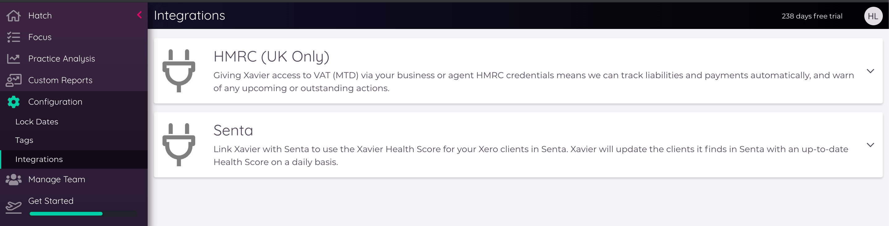

---
---

# Other Integrations
  Precision has a number of integrations with other apps and data sources. We hope to keep expanding this list!
  
  To manage your integrations in Precision, select '_Configuration_' and then '_Integrations_' in the team sidebar, this will 
  display all active and possible integrations. 
  
  
  
  
  ## HMRC (UK Only)

Never let a filing date slip by again: If your clients are MTD-ready. Precision can connect to HMRC to pull back important 
information on your clients' VAT filings, current connection status and obligations. 

### Getting set up

In the HMRC integration card, you’ll see your HMRC connection status; this manages your connection in Precision as a business 
or agent with HMRC, and will allow you to see the HMRC data for all your eligible clients. You can use the links on this 
card to understand more about the HMRC agent sign-in process.

### Using the data  

There are three main areas you will be able to access the information from HMRC for your clients: 

1. Practice Dashboard

Within the Practice Dashboard, if you scroll to the far right, you will be able to view a new section called “MTD VAT”. 
This is really handy for getting an overview of all your clients HMRC connection status, key VAT dates and status for 
the latest period.

2. HMRC Dashboard

Your location for all things MTD in your practice. Each row is a VAT period detected by Precision for each client, including 
the filing period, due dates, status, amount and outstanding values.    

3. VAT Return Checks

- Under the heading Tax Status, the first card will now show the submitted VAT total for the period. (if you are not connected 
to HMRC, or there is no HMRC data available for the selected period, you will be shown an estimated VAT total).

- HMRC status will list your current VAT obligations; 
    - Filing and Payment Status lists your filing obligations, and of the filed returns, which ones have been paid.
    - Payment History provides the date of your last submitted payment that Precision could detect. Opening this card lists all VAT payments you have made to HMRC by date.

- Future VAT Liability is an estimated value based on current Aged Receivables and Aged Payables. 

- VAT Control Account will reconcile your outstanding VAT liabilities with the VAT control account, to detect any differences.  
  
  ::: tip
    If you have just connected to HMRC, your Precision clients will need to refresh before the data can be collected. You can 
    either wait 24 hours for all your clients to refresh automatically, or refresh each of them manually. 
  :::
  
  
  ## Senta
  
  Precision integrates with [Senta Practice Management Software](https://www.senta.co/) to allow you to pull [Xavier health 
  scores](/clients.html#client-health-score) into Senta to display in your client lists and records. You'll then be able to use Precision health scores in custom 
  views, and to filter or trigger jobs in Senta.
  
  ::: warning Please note:
    Precision and Senta match clients based on their _Xero_ information, so _only_ clients connected _individually_ to Xero 
    in Senta will show in the connected list in Precision. A _practice level_ connection to Xero is not sufficient. 
  :::
  
  To set up the integration, you will need to follow these steps:
 
  __IN SENTA:__
    
  1. Enable the Precision integration, by going to _Settings -> General Settings -> Extras_ to toggle on the Precision integration. 
  This will add the "Precision Health Score" field to each clients' "Xero" tab, and adds a new "Xavier" integration user.
  
  2. Generate an API key in Senta via _Settings -> Users -> Integrations_ that Precision can use to access Senta.
  
  
  __IN PRECISION:__
  
  3. From the Team-level sidebar menu, head to _Configuration -> Integrations -> Senta_ and populate your Senta account 
  URL and API key in the "Connection Credentials" section.
  
  4. When you click 'Link to Senta', Precision will then do an initial connection to Senta and bring back any Xero-connected clients that it finds. These 
  will be shown in a list in the "Senta Clients" section of the integration. This section contains a filter for _Found in 
  Precision_ | _Not Found in Precision_ | _All_, so you can see any Xero clients you might be missing in Precision and add them. 
  
  Once the connection is complete, Precision Health Scores for the clients that are matched across the systems will be sent 
  over to Senta, and **refreshed on a nightly basis**. You will be able to view the scores in the "Xero" tab for each client, 
  and add a Health Score column to your client list.

  ::: tip
    Occasionally the health scores can take a few moments to show in Senta. After a short wait, refresh the page in Senta to check.   
  :::
  
  ## GoProposal
    
Precision integrates with [GoProposal pricing software](https://goproposal.com) to allow you to pull [Precision health 
scores](/clients.html#client-health-score) and activity metrics into GoProposal to inform your clients' pricing for more 
up to date data and insights than ever before. 

::: warning Please note:
  GoProposal will only have access to data from the client that the person generating the API key has access to - for 
  this reason, we recommend using the Team Owner to generate the API key.
:::

To set up the integration, you will need to generate an API key to plug into GoProposal. This can be found in the Team sidebar under Your Settings > selecting 'API' from the list on the left. You can watch [this handy video](https://www.loom.com/share/70dac4bf940349c1b61e386a7f5e2fe6) from Helen on how to generate this key [here](https://www.loom.com/share/70dac4bf940349c1b61e386a7f5e2fe6). 

Once you have generated your API key in Precision, the majority of the setup actually takes place in GoProposal.  

You can read more about the next steps in the [GoProposal help documentation here](https://help.goproposal.com/en/articles/4304626-how-to-connect-xavier-to-goproposal).
