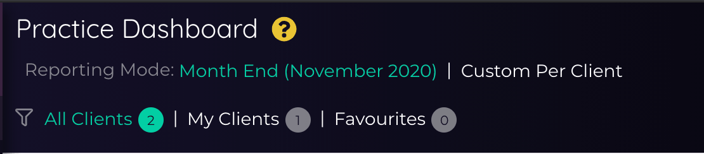

---
---

# The Sandbox & Practice Reports
The Sandbox is your data playground, a place where your KPI hopes and dreams can come to life. The Sandbox is available 
within any client that belongs to your team, and also at the Team level containing all data across all your clients. 

The Sandbox grid format is used throughout Dext Precision, usually wherever you see a table, so many of the tricks that apply to 
these large grid reports such as sorting and exporting also apply to the grids within cards.  

## The Client Sandbox

Each Client in Precision has a Sandbox view in the sidebar. A core piece of Precision functionality since it's launch, we start 
with Journal Line Items as a base, and supplement each record with additional data based on the type of
journal it is - be it an Invoice, Bank Transaction, Credit Note or so on. We also bring in Contact and Account
information so you've got all the key information you need in one place.

::: tip
Within the Practice Dashboard, any metrics not available for QBO or Xero clients specifically will be displayed as blank in the relevant column. You can filter for clients from a specific accounting software using the ‘Accounting Software’ column. 
::: 

To get started with the Client Sandbox, you can watch our latest Sandbox training webinar here:

<iframe width="560" height="315" src="https://www.youtube.com/embed/LiwjlNFiHs8?rel=0" frameborder="0" allow="autoplay; encrypted-media" allowfullscreen></iframe>

## Practice Analysis

At the team level, Dext Precision has 4 different practice-level sandboxes that contain data across all your clients. They are:

### Practice Dashboard
A comprehensive home for all your clients, this is the first place to come to get a handle on your practice. Each row is a client in Precision, and here we store many of our metrics. 

#### Reporting Mode

By default, the Practice Dashboard will be set to the Reporting Mode '*Month End*', which means all Practice Dashboard 
metrics come from the last complete month, to ensure that every metric is comparable for each client.  

If you select '*Custom Per Client*' the Practice Dashboard will use the [Reporting Mode](/clients.html#overview-reporting-mode) 
dates set against the client from the [Client Overview](/clients.html#client-overview). This will result in each client displaying metrics from their own custom Reporting Mode period (if set).  

Here's a short introduction to the Practice Dashboard functionality from Simon Williams; note that since this was recorded 
the dashboard is still evolving, and we add more metrics to it all the time!

<iframe width="560" height="315" src="https://www.youtube.com/embed/K9MX2tsKMW4?rel=0" frameborder="0" allow="autoplay; encrypted-media" allowfullscreen></iframe>

### Activity Stats
The Activity Stats view is your source for Precision's performance metrics from the [Activity Stats](/insights.html#activity-stats) 
Insight, month-by-month for the last year. This includes _MoM_ and _YoY_ changes, so you can check which of your clients 
are under- or over- performing. 

Note that the Activity Stats dashboard, like the Practice Dashboard, defaults to the data from the last complete month and works backwards from there.

### HMRC Dashboard

::: note
The HMRC dashboard is currently only available for Xero clients, we hope to make this available for QBO clients soon!
:::

For UK clients using our [HMRC integration](/integrations.html#hmrc-uk-only) this dashboard is your location for all things 
MTD in your practice. Each row is a VAT period detected by Precision for each client, including the filing period, due dates, 
status, amount and outstanding values.

### Focus Dashboard
This dashboard is an alternative to the [Flow List](/focus.html#the-flow-list) in [Focus](https://help.xavier-analytics.com/focus.html#focus), 
showing _all_ Flows at all stages of completion. This includes the all Flow details including the assigned team member, 
reviewers, reporting period, number of checks completed and total number of checks.

## Customising the Grid
The sandbox grid is a drag and drop report-builder, with spreadsheet-like functionality, right in your browser. And if you're
a fan of Excel's pivot tables, you'll find that too. You can choose the columns you want to see, group-by, sort, collapse
and expand until you get it just how you want. In the image below the sandbox has been customised to group by Contact,
sort by Gross Amount and hide some columns.

Interested in the tech? Behind the scenes we've integrated [ag-Grid's amazing data tables framework](https://www.ag-grid.com/),
which provides the enterprise-grade pivot table functionality.

## Custom Reports
Grown a liking to your sandbox setup? You can save sandbox configurations as custom reports by clicking *Save*.

You'll need to give your report a name. You can then decide whether to keep this report configuration private, or
share it with the rest of your team.

Custom reports are automatically added to your sidebar in the *Reports* section. The beautiful thing is that they are
available for any client that belongs to you or your team, not just the client you created it on.

You can make and save changes to a Custom Report configuration. When you do so you'll be asked whether you want to save
over the existing report or create a new one.

The Reports section also contains a number of Precision default reporting configurations developed by the Dext team, so 
be sure to check them out:

- Debtor Days and Cash Report (Practice Dashboard)
- Cost Review by Supplier (Client Sandbox)
- Cost Review by Report Code (Client Sandbox)
- Expenses by Month and Contact (Client Sandbox)
- Invoiced Totals by Contact (Client Sandbox)

Each custom report at the team level will have a coloured icon indicator next to it, to let you know where the data comes from:
- _Blue speedometer_: Practice Dashboard
- _Pink line chart_: Activity Stats
- _Yellow crown_: HMRC Dashboard

## Exporting Reports
From either the Sandbox or a Custom Report, or within any grid in a Check, you can export to a spreadsheet file. You can 
do this from the *Export* button in the banner at the top of the report (to produce a .xlsx file), or export to a csv 
file by right-clicking anywhere inside the grid and choosing *Export -> CSV Export*.

