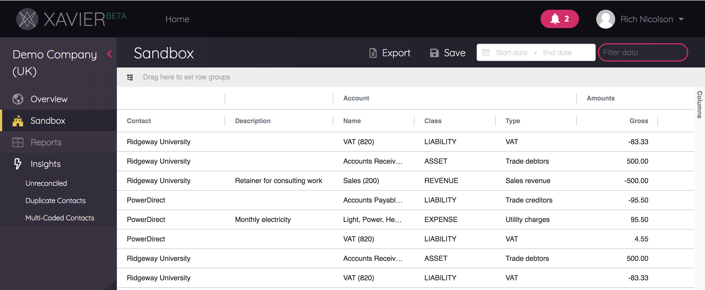
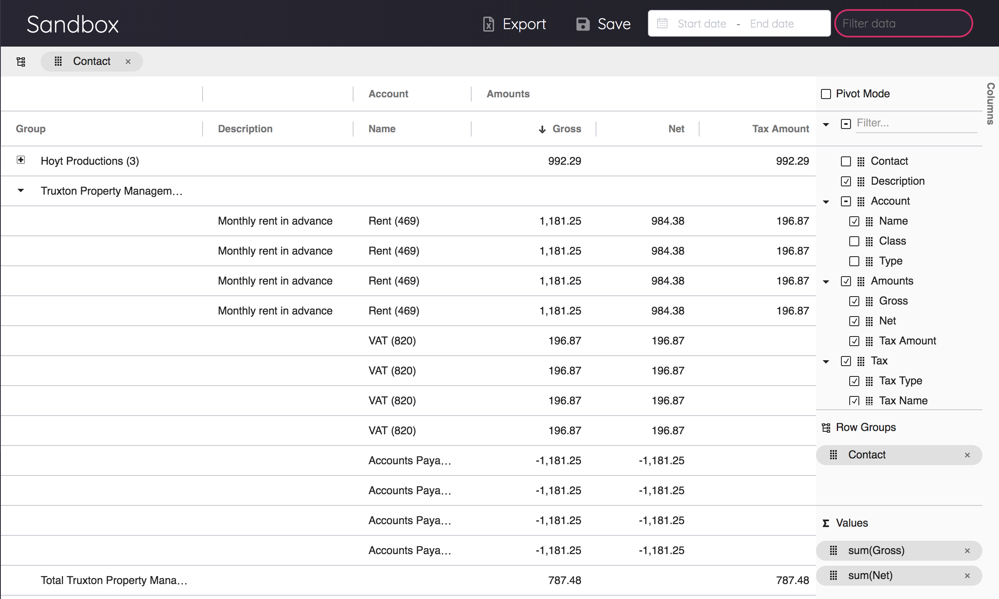
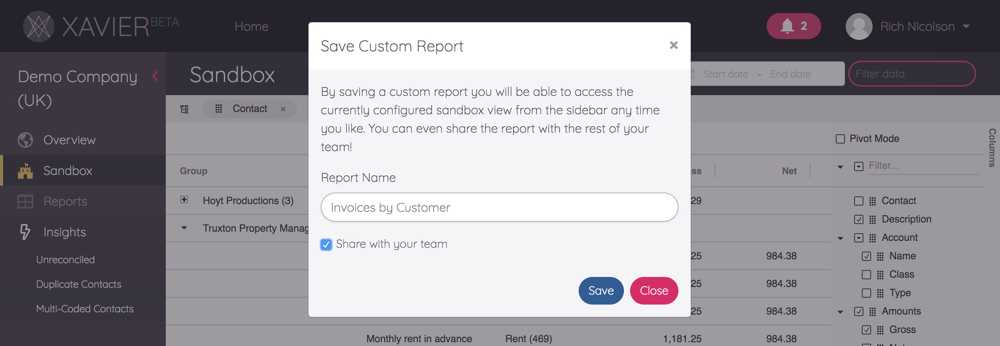
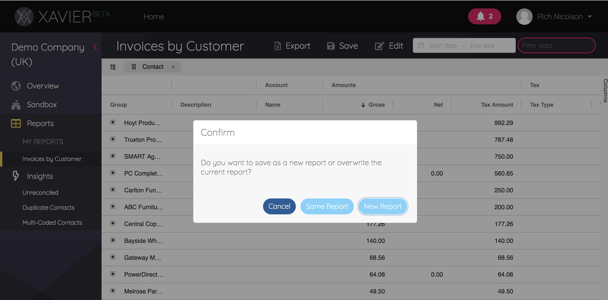

---
---

# The Sandbox & Reports
The Sandbox is your data playground, a place where your KPI hopes and dreams can come to life. The Sandbox is available
from within any client that belongs to your team.

## The Sandbox Data
We start with Xero's Journal Line Items as a base, and supplement each record with additional data based on the type of
journal it is - be it an Invoice, and Bank Transaction, a Credit Note and so on. We also bring in Contact and Account
information so you've got all the key information you need in one place.

## Customising the Sandbox
The sandbox is a drag and drop report-builder, with spreadsheet-like functionality, right in your browser. And if you're
a fan of Excel's pivot tables, you'll find that too. You can choose the columns you want to see, group-by, sort, collapse
and expand until you get it just how you want. In the image below the sandbox has been customised to group by Contact,
sort by Gross Amount and hide some columns.

Interested in the tech? Behind the scenes we've integrated [ag-Grid's amazing data tables framework](https://www.ag-grid.com/),
which provides the enterprise-grade pivot table functionality.

## Custom Reports
Grown a liking to your sandbox setup? You can save sandbox configurations as a custom report by clicking *Save*.

You'll need to give your report a name. You can then decide whether to keep this report configuration private, or
share it with the rest of your team.

Custom reports are automatically added to your sidebar in the *Reports* section. The beautiful thing is that they are
available for any client that belongs to you or your team, not just the client you created it on.

You can make and save changes to a Custom Report configuration. When you do so you'll be asked whether you want to save
over the existing report or create a new one.

## Exporting Reports
From either the Sandbox or a Custom Report, you can export to a spreadsheet file. You can do this from the *Export*
button in the banner at the top of the report (to produce a .xlsx file), or export to a csv file by right-clicking
anywhere inside the grid and choosing *Export -> CSV Export*.

