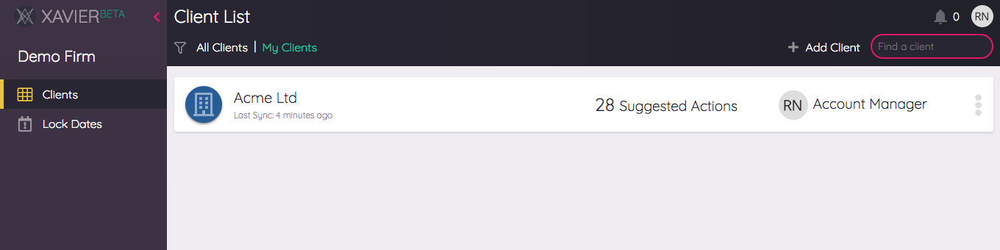

# Team
Xavier is designed for teams. Clients and shared reports can all be accessed by team members. There is no limit to the 
number of team members you can have in Xavier, and your subscription pricing is based on the number of clients you have
linked, not how many members are in your team. Your team is created when you register - even if you fly solo
you'll be the owner of a "team" in Xavier.

## Team Roles
The creator of a team will be the team owner, everyone else will be team members. Only the team owner can perform 
team management actions like inviting a team member or adjusting billing and subscription settings.  

## Inviting Team Members
If you're the team owner, you can invite other people to become members of your team via the *Invite Team* action in the 
menu underneath your user icon in the top-right corner of Xavier. This will take you through to the *Membership* section
of the team settings.

 

An invite will be emailed to your colleague with a link to Xavier. When they click on the link in the email to accept,
they'll be asked to sign up and provide login details. They'll be automatically added to your team via this process.

## Account Managers
If your team manages many clients, you'll likely have a concept in your team structure where certain people look after
certain clients. In Xavier, we refer to these people as *Account Managers*.

When you first create a Xavier client, you'll be automatically assigned to that client as the Account Manager. You can
see who each client's Account Manager is on the Client List, and filter the list so that you only see the clients that 
you manage:

To change who the Account Manager is for a client, click on the client in the client list, then *Edit* from the Client 
Overview. 

Aside from having a streamlined view in the Client List, we have bigger plans for the Account Manager function - watch 
this space!

## Lock Dates
*Coming Soon*