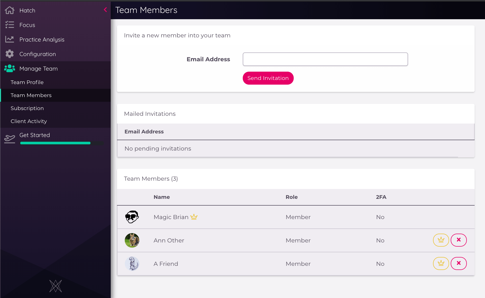
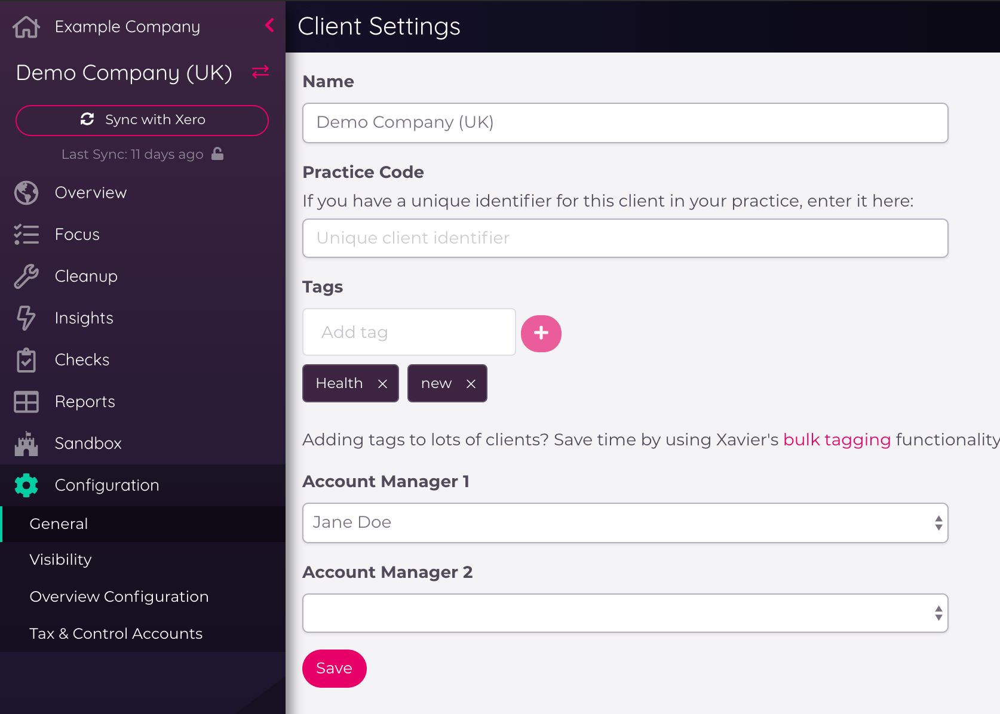

---
---

# Team
Dext Precision is designed for teams. Clients and shared reports can all be accessed by team members. There is no limit to the
number of team members you can have in Precision, and your subscription pricing is based on the number of clients you have
linked, not how many members are in your team. Your team is created when you register - even if you fly solo
you'll be the owner of a "team" in Precision.

## Team Roles
The creator of a team will be the team owner, everyone else will be team members. Only the team owner can perform
team management actions like inviting a team member or adjusting billing and subscription settings.

## Team Settings

The Team Settings are available in the sidebar in the *Team View*; from here, you can manage all things Team related...

### Team Roles

For the standard [(non-enterprise)](/team-management.html#xavier-enterprise-team-roles) version of Precision, there are three different user roles:

* __Owner__: Owners have the same permissions as Admins. This role defaults to the person who created the Precision team. There can only be one team Owner per team.

* __Admin__: In addition to the permissions of team Members, Admins can: invite new team members, manage the Precision subscription, add the Team Logo, and by default they can also view all clients added to Precision.
 
* __Member__: Team members can add and remove clients, and adjust the [visibility settings](https://help.xavier-analytics.com/clients.html#client-visibility) of those clients they are able to view. All team members can add, delete, and review Flows.

### Team Profile
You can add a team icon here, and also add a *branding header*. This header image will be added to the top of Precision's
PDF exports. It's best suited to a smaller logo than a large facebook-style banner image, as it will display at about
70px high on the PDF, so we would recommend uploading an image no larger than 100px tall, and no wider than 800px.
We only accept .jpg and .png image formats.

You can also change your Team Name in this view, if you need to. Fix a typo, have an identity crisis, or go for a whole pivot!

### Team Members
This view allows you to invite, view and update all members of your team in Precision. See [below](#inviting-team-members)
for more information on how to manage your team.

### Team Subscription
Manage your subscription with Precision, view your subscription plan and the breakdown of Precision's rolling discounts within your clients.
You can also manage your billing information, and add any coupon codes.

## Dext Precision Enterprise Team Roles

Precision has four different user roles for Enterprise teams:

* __Owner__: This is the "Super Admin" that is owner of the team(s)
* __Admin__: Part of the management team with wide-ranging permissions
* __Adviser__: Team member with elevated permissions
* __Member__: Team member with restricted permissions

The access permissions for these team members are as follows:

| Action/View                                    | Member Permission  | Adviser Permission | Admin Permission  | Owner Permission  |
| ---------------------------------------------- |:------------------:|:------------------:|:-----------------:|:-----------------:|
Can invite new team members                      |	N                 |	N	               | N                 | Y                 |
Access to Portfolio-wide client list/app         |	N                 |	N	               | N	               | Y                 |
Can create a Portfolio-wide Custom Report (coming soon)|N             | N                  | N                 | Y                 |
Access to team settings                          |	N                 |	N                  | Y                 | Y                 |
Access to client settings (tags, visibility, etc)|	N                 |	N                  | Y	               | Y                 |
Can add a new client                             |	N                 |	N                  | Y	               | Y                 |
Can manage team integrations                     |	N                 |	N                  | Y                 | Y                 |
Can create a Team-wide Custom Report             |	N                 |	Y	               | Y                 | Y                 |
Can create Flow templates                        |	N                 |	Y                  | Y                 | Y                 |
Can delete Flows                                 |	N                 |	Y                  | Y                 | Y                 |
Can review and approve completed Flows           |	N                 |	Y                  | Y                 | Y                 |
Can create a Flow from existing template         |	Y                 |	Y                  | Y                 | Y                 |
Can create a private Custom Report               |	Y                 |	Y                  | Y                 | Y                 |

## Inviting Team Members
If you're the team owner, you can invite other people to become members of your team in the *Team Members* section of the
*Manage Team* list in the sidebar, or via the *Invite Team* action in the menu underneath your user icon in the top-right corner of Precision.
This will also take you through to the *Team Members* view.

An invite will be emailed to your colleague with a link to Precision. When they click on the link in the email to accept,
they'll be asked to sign up and provide login details. They'll be automatically added to your team via this process.

::: warning
Dext Precision is designed for inviting _internal_ team members only. We recommend you either use Precision's Export functions to 
share Precision data with clients, or create a separate Precision team for that client.  

If you invite clients as team members, while you can set [Client Visibility](/clients.html#client-visibility) settings, 
those users _will_ still be able to see the names and email addresses of other users in the team in some parts of Precision.   
:::

## Two-Factor Authentication

::: warning
The following 2FA guidance is only applicable for partners who joined Precision before February 2021, and/or have not been migrated to a new Dext account. If you are not sure if this applies to you, please contact support at contact@xavier-analytics.com.   
:::

Team Members can enable Two-Factor Authentication (2FA). 2FA provides additional account security by requiring you to
provide a token during login in addition to your username and password. This token is retrieved from an application on
your mobile phone. Precision uses [Authy](https://authy.com/) to provide 2FA. To get started, Team Members should download
and install the Authy mobile app for iOS or Android, then follow the instructions below:

### Enabling 2FA
Turning on 2FA in Precision is simple. Select 'Your Settings' in the sidebar navigation from the _Client List_, then head to _Security_. 
Enter your country code (e.g. +44 for the UK) and mobile number and click "Enable".

::: tip
Dext Precision will give you an emergency recovery token that allows you to login if you've lost your phone. Take note of it
immediately by storing it in a safe secure place, such as a Password Manager.
:::

### Logging in with 2FA
If you have 2FA enabled, enter your email address and password like normal, then you'll be presented with one extra step
where you need to enter the 2FA token. Retrieve this from the Authy mobile app.

### Disabling 2FA
You can disable 2FA in the same place you enabled it.  Select 'Your Settings' in the sidebar navigation from the _Client List_, then head to _Security_.

### Monitor Adoption of 2FA
If you're the team owner, you can see which team members have enabled 2FA. In the sidebar when viewing the _Client List_, select _Team Settings_, then head to _Team Members_.

## Account Managers
If your team manages many clients, you'll likely have a concept in your team structure where certain people look after
certain clients. In Precision, we refer to these people as *Account Managers*.

When you first create a Precision client, you'll be automatically assigned to that client as the Account Manager. You can
see who each client's Account Manager by their icon on the Client List card, and filter the list so that you only see the clients that
you manage:

To change who the Account Manager is for a client, click on the client in the client list, then open the *configuration* menu from the Client Sidebar. Under this menu, you'll see an option for *General* settings:

Making sure that you have the right Account Managers assigned provides a streamlined view in the Client List and easy Flow assignment in [Focus](/focus.html#focus), as well as better practice performance overviews in the [Practice Dashboard](/sandbox-reporting.html#practice-dashboard) and [Focus Dashboard](/sandbox-reporting.html#focus-dashboard).

## Lock Dates
Lock Dates, or Closing Dates are a feature of Xero and QBO respectively designed to help prevent changes to records in periods that have already been reported on or filed.

Dext Precision combines knowledge of a client's lock dates or closing dates with account filing information from Companies House (where available) to help you keep data stable.

### Lock Dates in Xero

As you can see in the Xero screenshot above, there are two lock date concepts in Xero. Xero do not give them specific
names, but in Precision we define them as:

* **Reporting Period Lock Date** (the first one in Xero): this lock date usually tracks your monthly or quarterly
reporting period. Records older than this lock date *shouldn't usually* be altered, but since the financial year may
still be active then this may still happen - but only advisors should be able to alter.

* **End of Year Lock Date** (the second one in Xero): this is the date at which the last filed company's accounts were
made up to. No changes should be made to records beyond this date. The implications of changing this are usually more
severe.

There are some limitations to Xero's handling of lock dates: anyone with access to a client's settings in Xero can
change the lock dates. There is nothing preventing users from changing the locked period to a date in the past,
allowing them to change historical records, and there is no history of this change taking place. If this is problematic
for you, Precision has your back...

### Lock Date History
Precision tracks changes to Xero's lock dates. You can view the history of these changes from *Insights* > *Lock Date History*:

Changes that have shifted the dates backwards are flagged so that you can quickly spot possible issues and dig deeper.
Reporting Period backwards changes are flagged with a warning, End of Year backwards changes get an error flag.

### End of Year Dates
If a company registration number is provided in Xero, Precision queries Companies House to get accounts filing information.
If the last-filed date in Companies House is more recent than the current End of Year lock date in Xero, Precision will
raise a warning.

### Reporting Periods
By encouraging the active maintenance of monthly reporting period lock dates in Xero, your team can reduce the amount
of data inconsistencies between Xero and third parties.

A typical reporting cycle might be that at the end of each month,
the accounting team has two weeks to prepare and submit their end of month reports to a client. Once the reports are
submitted the Reporting Period Lock Date would be brought forward in Xero to restrict changes from being made in the
closed period.

In Precision, you can configure a team-wide grace period that indicates how long your team has to close off the month and
update the lock dates in Xero:

If a client's Reporting Period Lock Date slips behind the grace period, Precision will show this as an alert on the *Client
Overview* page.

### Locked Records in Reporting

The concept of records being in locked periods is carried throughout Precision. The Sandbox, custom reports and insights
such as Unreconciled Transactions all show whether a particular record falls within a locked period. You can then choose
to filter out or sort by this attribute.

Learn more about [lock dates in Xero](https://central.xero.com/s/article/Set-up-and-work-with-lock-dates).

