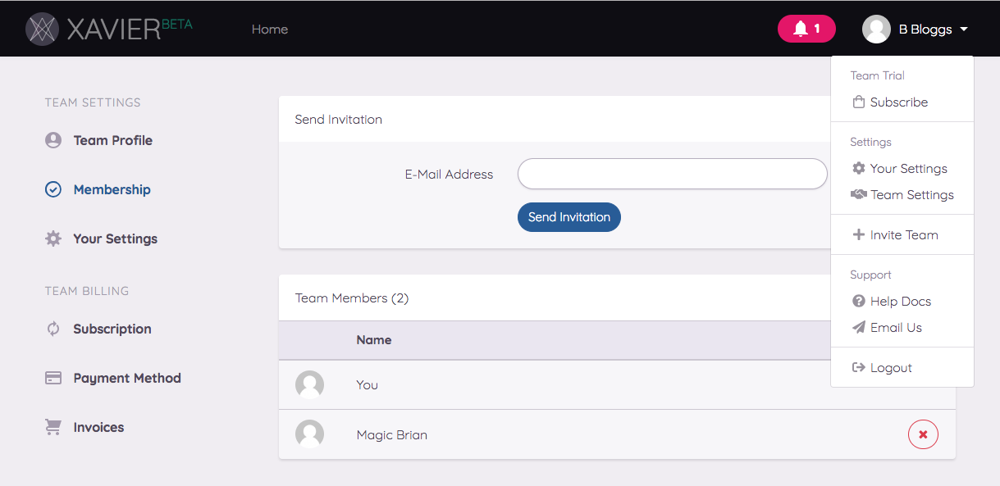
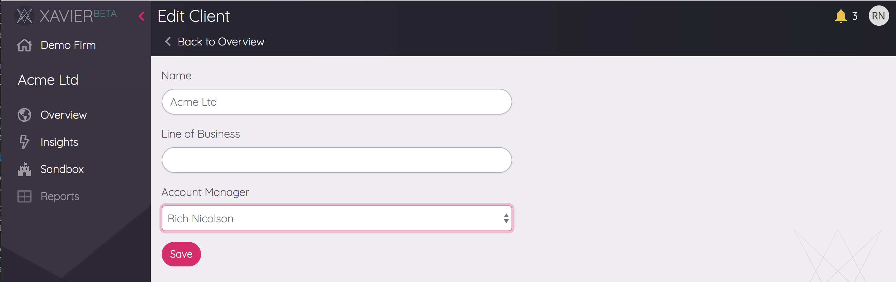
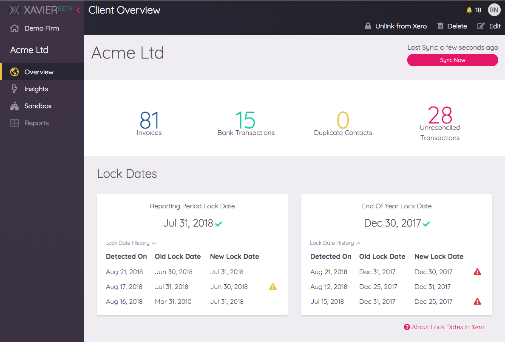

# Team
Xavier is designed for teams. Clients and shared reports can all be accessed by team members. There is no limit to the 
number of team members you can have in Xavier, and your subscription pricing is based on the number of clients you have
linked, not how many members are in your team. Your team is created when you register - even if you fly solo
you'll be the owner of a "team" in Xavier.

## Team Roles
The creator of a team will be the team owner, everyone else will be team members. Only the team owner can perform 
team management actions like inviting a team member or adjusting billing and subscription settings.  

## Inviting Team Members
If you're the team owner, you can invite other people to become members of your team via the *Invite Team* action in the 
menu underneath your user icon in the top-right corner of Xavier. This will take you through to the *Membership* section
of the team settings.

 

An invite will be emailed to your colleague with a link to Xavier. When they click on the link in the email to accept,
they'll be asked to sign up and provide login details. They'll be automatically added to your team via this process.

## Account Managers
If your team manages many clients, you'll likely have a concept in your team structure where certain people look after
certain clients. In Xavier, we refer to these people as *Account Managers*.

When you first create a Xavier client, you'll be automatically assigned to that client as the Account Manager. You can
see who each client's Account Manager by their icon on the Client List card, and filter the list so that you only see the clients that 
you manage:

To change who the Account Manager is for a client, click on the client in the client list, then *Edit* from the Client 
Overview. 

Aside from having a streamlined view in the Client List, we have bigger plans for the Account Manager function - watch 
this space!

## Lock Dates
Lock Dates are a feature of Xero designed to help prevent changes to records in periods that have already been reported 
on or filed:

Xavier combines knowledge of a client's lock dates in Xero with account filing information from Companies House 
(where available) to help you keep Xero data stable.

As you can see in the Xero screenshot above, there are two lock date concepts in Xero. Xero do not give them specific
names, but in Xavier we define them as:

* **Reporting Period Lock Date** (the first one in Xero): this lock date usually tracks your monthly or quarterly 
reporting period. Records older than this lock date *shouldn't usually* be altered, but since the financial year may 
still be active then this may still happen - but only advisors should be able to alter.  

* **End of Year Lock Date** (the second one in Xero): this is the date at which the last filed company's accounts were 
made up to. No changes should be made to records beyond this date. The implications of changing this are usually more 
severe.

There are some limitations to Xero's handling of lock dates: anyone with access to a client's settings in Xero can 
change the lock dates. There is nothing preventing users from changing the locked period to a date in the past,
allowing them to change historical records, and there is no history of this change taking place. If this is problematic 
for you, Xavier has your back...

### Lock Date History
Xavier tracks changes to Xero's lock dates. You can view the history of these changes from *Insights* > *Lock Date History*:

Changes that have shifted the dates backwards are flagged so that you can quickly spot possible issues and dig deeper.
Reporting Period backwards changes are flagged with a warning, End of Year backwards changes get an error flag. 

### End of Year Dates
If a company registration number is provided in Xero, Xavier queries Companies House to get accounts filing information.
If the last-filed date in Companies House is more recent than the current End of Year lock date in Xero, Xavier will
raise a warning. 

### Reporting Periods
By encouraging the active maintenance of monthly reporting period lock dates in Xero, your team can reduce the amount 
of data inconsistencies between Xero and third parties. 

A typical reporting cycle might be that at the end of each month,
the accounting team has two weeks to prepare and submit their end of month reports to a client. Once the reports are 
submitted the Reporting Period Lock Date would be brought forward in Xero to restrict changes from being made in the 
closed period. 

In Xavier, you can configure a team-wide grace period that indicates how long your team has to close off the month and 
update the lock dates in Xero:  

If a client's Reporting Period Lock Date slips behind the grace period, Xavier will show this as an alert on the *Client
Overview* page.

### Locked Records in Reporting

The concept of records being in locked periods is carried throughout Xavier. The Sandbox, custom reports and insights 
such as Unreconciled Transactions all show whether a particular record falls within a locked period. You can then choose
to filter out or sort by this attribute.

Learn more about [lock dates in Xero](https://central.xero.com/s/article/Set-up-and-work-with-lock-dates).