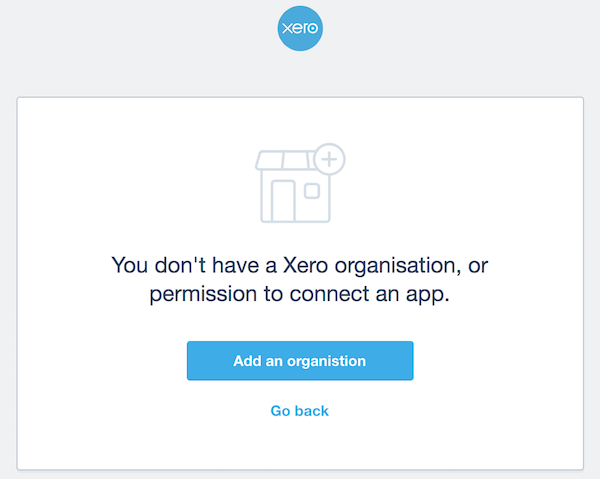

# Troubleshooting

## Xero Access Permissions 

When trying to add a client to Xavier, or re-connecting an existing client, 
you're redirected to Xero to give your approval. In some situations you may be presented with this:

 

There are a few reasons why you may be seeing this:

* **You don't have a Xero account**: Not to worry, you can [try Xero for free!](https://www.xero.com/signup/?xtid=x30xavier)

* **You are logged into Xero as a different user**: you may be logged in to Xero as a user you were not intending to use with Xavier. 
Try [heading over to Xero](https://go.xero.com/Dashboard/default.aspx/?xtid=x30xavier) and logging out before trying to add a client in 
Xavier again. This time you'll be asked to log into Xero, so you can log in as the user you intended.

* **You do not have the permissions in Xero**: each Xero user account has a 
[role assigned](https://central.xero.com/s/article/User-roles-and-permissions-in-Xero-Business-edition) 
to it for a Xero organisation.
You need to have either an *Advisor* or a *Standard* role to add a client in Xavier. This gives you access to an organisation's Xero settings,
including the ability to [set up or disconnect connected apps](https://central.xero.com/s/article/User-role-access-to-settings-in-Xero)

Still stuck? [Get in touch](/contact-us.html), we're here to help.

## Slow Client Syncing

We wish it wasn't so, but sometimes [good things take time](https://youtu.be/qcILD9OJ2wg). 

You're most likely encounter a bit of a wait when first adding a client to Xavier, during the initial sync with Xero. We import 
as much data as we can from Xero into Xavier - the more we bring in, the more powerful and flexible your reporting can be.

We cover the types of data imported from Xero in our [Xero Integration](/xero-integration.md) guide.

Syncing of a new client can take up to 45 minutes for clients with a long history in Xero where hundreds of thousands of 
journals entries, invoices and bank transactions are in play. 

Rest assured that we've optimised this process to be as fast as possible - the primary limiting factor here is Xero's API: 
even as certified partners we still have restrictions on how fast we can pull data out of Xero. If you're interested in the 
tech side of things, you can read about Xero's API rate limits [here](https://developer.xero.com/documentation/auth-and-limits/xero-api-limits). 

Subsequent syncs, either manual or automated overnight, only retrieve the xero records that have changed since the last sync, 
so should be substantially faster in comparison.

Think your import is taking too long or has failed? [Get in touch](/contact-us.html), we're here to help.    